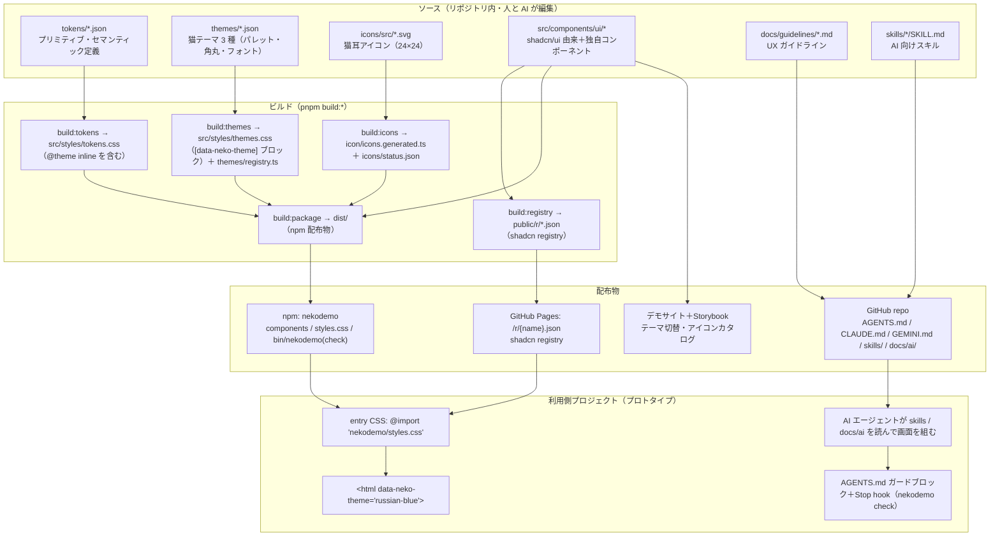
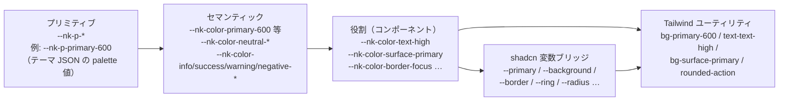
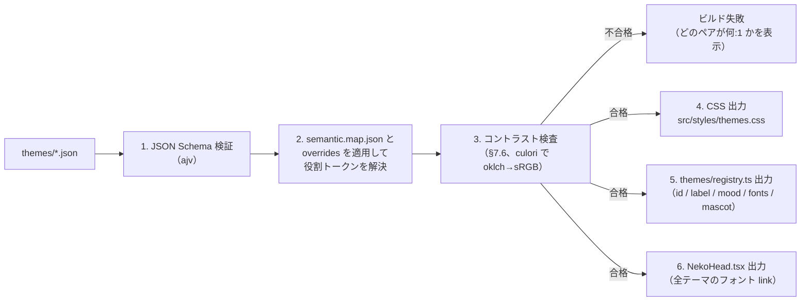
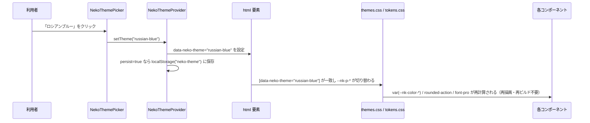
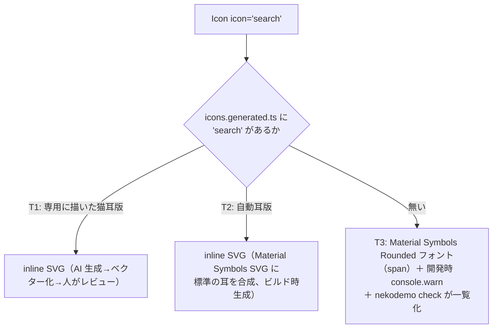
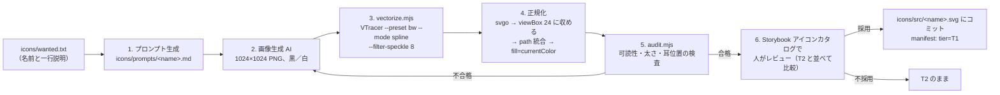
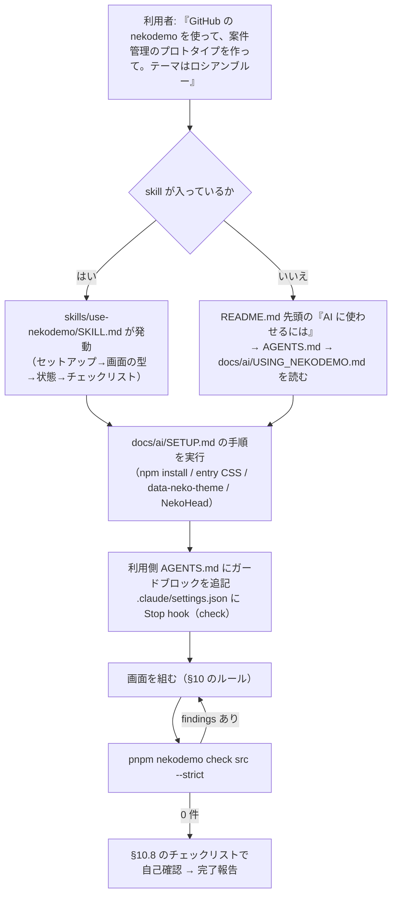
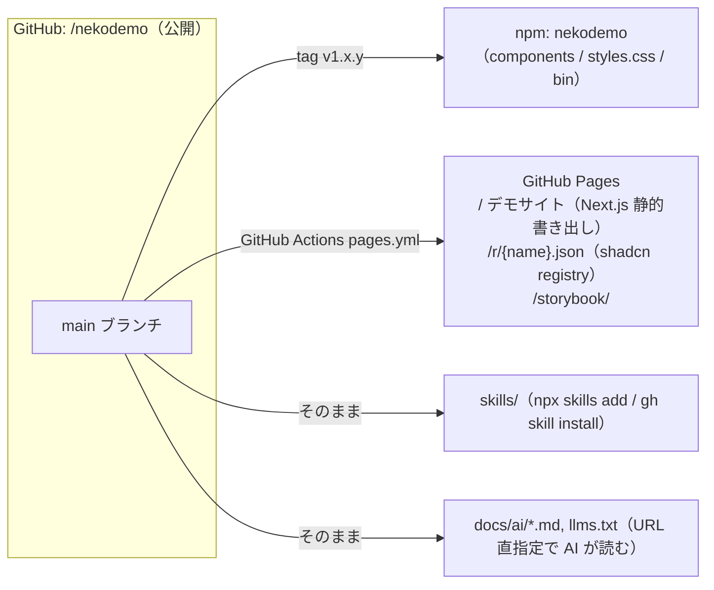
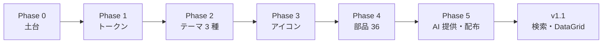

# nekodemo（猫デザインシステム）設計書 v0.1

> Claude Code に実装させるための設計ドキュメント。
> 作成日: 2026-09-21 ／ 作成者: 五十棲（ずうみん）＋ Claude ／ 状態: **ドラフト（レビュー待ち）**

---

## 0. この文書の読み方

| 表記 | 意味 |
|---|---|
| 【事実】 | 公開サイト・npm・公式ドキュメントで確認した内容。出典を併記する |
| 【設計判断】 | この文書で決めたこと。理由を併記する |
| 【初期案】 | 数値やパレットなど、実装時に検証して変える前提の値 |
| 【未確認】 | 実装時に確認が必要なこと。確認せずに実装しない |
| 【対象外】 | v1 では作らないこと |

Claude Code への指示: 【未確認】は実装前に必ず確認して結果をこの文書に追記する。【初期案】の数値は自動チェック（§7.6 コントラスト検査など）を通るまで調整してよいが、調整結果はテーマ JSON に反映して残す。

---

## 1. 背景と、この設計が解く課題

### 1.1 現場の課題（起点）

プロトタイプ作成と検証（ユーザーインタビュー等）を現場で行うと、次の 5 つの問題が繰り返し起きる。

| # | 課題 | 具体的に何が起きるか |
|---|---|---|
| C1 | 見た目にインタビュー対象者が反応してしまう | 「色が地味」「なんかチープ」など見た目へのフィードバックが先に出て、検証したい体験の話ができない。「この程度のものを作ろうとしているのか」という否定的な受け取られ方もする |
| C2 | 作り込むと手間が増える | C1 を避けるために見た目を整えると、プロトタイプなのに実装工数がかかる |
| C3 | コンポーネントライブラリの指定だけでは品質が出ない | 「shadcn を使って」と AI に指示しても、UX の決まりごと（状態設計・余白・文言・操作の原則）が無いので、部品は綺麗でも画面としては低品質になる |
| C4 | どれも同じ見た目になる | 白背景・青がプライマリの、よくある業務アプリの見た目に収束する |
| C5 | AI がゼロから作り直してトークンを浪費する | デザインシステムがあっても部品が揃っていないと、AI が毎回自作し、生成ルールも無いので出力がぶれる |

### 1.2 解決の方針（要約）

猫をテーマにした「おふざけだが実用に耐える」デザインシステム **nekodemo**（仮称）を作り、GitHub と npm で公開する。AI コーディングツール（Claude Code / Gemini CLI / Codex / ChatGPT 等）に「nekodemo を使って」と指定するだけで、**かわいくて使いやすいプロトタイプ**が、決まったルールで、少ないトークンで出来上がる状態を目指す。

| 課題 | nekodemo での打ち手 | 参照 |
|---|---|---|
| C1 | 猫テーマ（アメショ／ロシアンブルー／三毛）で「これは検証用の楽しいモック」と一目で伝わる。可愛さが見た目批判の矛先を逸らし、使いにくさは指摘しやすいまま残す | §7 |
| C2 | 部品・テーマ・アイコンが最初から揃っており、AI が組むだけで見た目が完成する | §8, §9 |
| C3 | 「使い方のルール（UX ガイドライン）」と「プロトタイプ完成チェックリスト」を AI が読む形式（AGENTS.md / skills / lint）で同梱する | §10, §11 |
| C4 | 3 テーマとも白背景＋青ではない配色。テーマは `data-neko-theme` 属性 1 つで切替 | §7 |
| C5 | Tailwind の既定パレットを無効化し、nekodemo のトークン以外はビルドで存在しない状態にする。lint（`nekodemo check`）で違反を検出し、AI の応答終了時に自動実行する | §6.5, §11.4 |

### 1.3 用途とスコープ

- **用途**: デモ、プロトタイプ、社内検証、ユーザーインタビュー用モック。本番プロダクトでの利用は想定しない。
- **利用者**: PdM・デザイナー・エンジニアが AI コーディングツールに指定して使う。人が直接 import して使うこともできる。
- **v1 の範囲**（§15 で完成条件を定義）: テーマ 3 種、猫耳アイコン基盤、画面が組める中核コンポーネント一式、AI 向け提供物（ガイド・skills・lint）、配布（GitHub / npm / shadcn registry / デモサイト）。
- **v1.1**: 検索フォーム（MUI `useAutocomplete` ベース）、DataGrid（TanStack Table ベース）。
- **v1.2 以降**: 残りのコンポーネント、セットアップ CLI、MCP。

---

## 2. 決定事項ログ

この文書を書くにあたって決めたこと。変更する場合はここを更新する。

| # | 決定 | 選ばなかった案 | 理由 |
|---|---|---|---|
| D1 | **shadcn/ui（MIT）を土台に独自実装**する。Sparkle Design は公開ガイドライン（トークン階層・コンポーネント仕様・提供方法）を設計思想の参考にする | 公開 npm の `sparkle-design` をフォーク／依存にする | Sparkle の React リポジトリは非公開扱い。npm 版を依存にすると部品内部のアイコン（Material Symbols）を差し替えられず「全部猫耳」ができない。ライセンス面でも独自実装が最も安全（§3.3） |
| D2 | **公開 OSS 前提**で設計する（GitHub 公開・npm 公開・shadcn registry・skills） | 社内限定 | ChatGPT など Web 版の AI にも URL 指定で読ませたい。ただし公開前に §3.3 のチェックリストを完了する |
| D3 | テーマは **ランタイム切替**（`<html data-neko-theme="…">`）を基本にする。CSS は 3 テーマ分を 1 ファイルに同梱 | テーマごとに CSS をビルドし分ける | 「選ぶのが楽しい」を成立させるにはページ内で即切替できる必要がある。Tailwind v4 の公式パターン（CSS 変数の参照先を属性セレクタで差し替える）で実現できる（§7.4） |
| D4 | 検索フォームは **`@mui/material/useAutocomplete`**（ヘッドレスフック）を採用し、見た目は nekodemo トークンで組む（v1.1） | 社内アプリにある自前実装（MUI 非依存）を移植 | キーボード操作・複数選択・freeSolo の挙動が枯れている。emotion は任意依存なので不要（§9.3） |
| D5 | DataGrid は **TanStack Table（ヘッドレス）** ＋ nekodemo の Table を描画層にする（v1.1） | MUI DataGrid | テーマの二重管理を避ける。列固定・多列ソート・仮想化が無料で使える（§9.4） |
| D6 | 猫耳アイコンは **AI 画像生成 → ベクター化** で量産し、Material Symbols と**同じ名前**で登録する。未作成分は Material Symbols にフォールバック | Figma で手描き／既存猫アイコン集 | 量産しやすい。名前を揃えることで AI が既に知っているアイコン名（`search`, `delete` 等）がそのまま使える（§8） |
| D7 | Tailwind の**既定カラーパレットを無効化**し、nekodemo のトークンだけを Tailwind ユーティリティとして公開する | 既定パレットを残す | AI が `bg-blue-500` 等を書いてもクラスが存在しない状態にし、ルール逸脱を構造的に防ぐ（§6.5） |
| D8 | v1 では **セットアップ CLI を作らない**。セットアップ手順は skill（`setup-nekodemo`）と `docs/ai/` に完全な手順として書き、AI に実行させる | v1 で `nekodemo-cli setup` を作る | CLI は保守コストが高い。まず手順の正しさを固め、v1.2 で CLI 化する |
| D9 | 名称は **nekodemo**（仮）。npm パッケージ名 `nekodemo`、CSS 変数プレフィックス `--nk-`、HTML 属性 `data-neko-theme` | `neko-ds` 等 | 2026-09-21 時点で npm に `nekodemo` / `neko-ds` / `nekodemo-ds` / `neko-design` / `cat-ds` は未使用【事実: `npm view` で確認】。正式名称は公開前に決める |
| D10 | 「Sparkle」という語を製品名・パッケージ名・属性名に使わない | — | Sparkle 利用規約の「名称・ブランドイメージを誤認させる使用」禁止に抵触しないため（§3.3） |
| D11 | GitHub リポジトリは **`gp-ryoga-isozumi/nekodemo-cat-design-system`（公開）**。GitHub Pages は `https://gp-ryoga-isozumi.github.io/nekodemo-cat-design-system/`、Next.js の `basePath` は `/nekodemo-cat-design-system`。npm パッケージ名は `nekodemo`（D9）のまま | `<owner>/nekodemo` | 2026-09-21 に利用者が決定。リポジトリ名と npm 名は一致させなくてよい。本文中の `<owner>/nekodemo` はこの値に読み替える |
| D12 | **ロシアンブルーはダーク scheme**。テーマ JSON に `scheme`（`light` または `dark`）を持たせ、`semantic.map.json` は役割トークンの対応表を `light` / `dark` の 2 組持つ。プリミティブの段階（50 = 最も明るい … 900 = 最も暗い）はテーマに関わらず固定し、ダークでは対応表側で反転させる（`text-high` → neutral.50、`surface-page` → neutral.900、`surface-primary` → primary.300 等） | 全テーマ light（初版）／ダークはテーマ ID を増やして対応 | 2026-09-21 のプレビューで利用者が「ロシアンブルーは黒に近い青灰の地でダークモード風に」と決定。部品は役割トークンだけを使う規約なので、対応表の差し替えだけで全部品が追従する（Phase 0.5 で確認済） |
| D13 | **チェックマークと Avatar フォールバックは猫の顔の塗りつぶし**。Checkbox のチェックは `cat_face` アイコン（nekodemo 独自名。丸い顔＋両耳のシルエット）、Avatar の画像なし時も同じシルエット。**Badge は通常の丸（ピル）** | 耳付き `check`、肉球（一度試して不採用）、猫の顔の形のバッジ（一度試して不採用） | 2026-09-21 のプレビューで利用者が決定。肉球は小さいサイズで判別しにくく、顔形のバッジは通常の丸に戻した |
| D15 | **フォントは 3 テーマ共通**（`font-pro` = Zen Maru Gothic、`font-mono` = Noto Sans Mono）。テーマ JSON の `fonts` キーは残す（将来テーマごとに変えられる）が、v1 の 3 テーマは同じ値にする | テーマごとに Inter＋Noto Sans JP / IBM Plex Sans JP 等を使い分ける | 2026-09-21 のプレビューで利用者が「三毛のフォントを他の 2 つにも」と決定。丸ゴシックの親しみやすさが nekodemo の統一した個性になる |
| D14 | **猫耳は本体と同じ線幅の中抜き三角**。耳は塗らず、本体と同じ 2 の線で「へ」の字（付け根 2 点＋頂点）を描く。付け根は本体の輪郭上に置き、底辺は本体の輪郭を共有する。角は round join / round cap で丸める。高さは付け根から約 4.5〜5、付け根の幅は約 3.5〜4 | 塗りの三角（初版）、塗り＋輪郭（2 回目） | 2026-09-21 に利用者が参考画像（猫耳カチューシャのアイコン）を示して決定。中抜きにすると太い線でも重くならず、本体と一体に見える |

---

## 3. 参照した公開情報と、ライセンス上の線引き

### 3.1 Sparkle Design（公開サイト）から参考にする点

出典: https://sparkle-design.goodpatch.com/ （2026-09-21 閲覧）

| 参考にする点 | 公開サイトでの記述【事実】 | nekodemo での扱い |
|---|---|---|
| トークンの階層 | Themes/Color: 「Primitive（Black & White, Gray, 10 色 × 50〜900、500 がキーカラー）→ Semantic（neutral / primary / secondary / info / success / warning / negative）→ Component（low / middle / high / placeholder 等）」の階層。Primitive を直接使うのは Black & White のみ | 同じ 3 層構造を採用（§6）。命名は nekodemo 独自 |
| タイポグラフィ | 12px〜54px の 12 段階、Regular 400 / Bold 700、行間 4 段階、字間 4 段階、アイコンフォントは Material Symbols Rounded | 同じ範囲の 12 段階スケールを採用（§6.4）。Material Symbols は Apache-2.0 なので名前体系とフォールバックに利用 |
| アイコン | 12 段階（12〜54px）、fill 0/1、「アイコンは文字情報の補助。単独で使うときは意味が明瞭であること」 | サイズ段階と fill の API を踏襲（§8.2） |
| コンポーネントの一覧 | Components に 45 個（Avatar〜Vertical Tabs） | v1 の部品名はこの一覧と対応付ける（§9.1） |
| Input Search の仕様 | Container / Icon / Value / Clear Trigger / Condition Trigger、高さ sm 32 / md 40 / lg 48 | 検索フォームの寸法・要素構成の参考（§9.3） |
| Table の仕様 | Container / Header（スクロール時固定）/ Body、高さ Xs 40 / Sm 56 / Md 80、数値は等幅フォントで右寄せ、縞模様や縦罫線は使わない。ソート・選択・空状態・ページネーションは未記載 | DataGrid の密度と表現ルールの参考（§9.4） |
| Patterns | サイドパネル／モーダルとモードレス／送信ボタンの初期状態 の 3 パターンが公開 | UX ガイドラインでリンク参照する（文面は転載しない）（§10） |
| 提供方法（React ページ） | `npm install sparkle-design`、`npx shadcn@latest add @sparkle-design/button`（registry）、`sparkle.config.json`（primary / font-pro / font-mono / radius）→ `npx sparkle-design-cli generate` → `sparkle-design.css` + `SparkleHead.tsx`、CLI に `setup` / `check` がある | 提供方法の型として踏襲（設定ファイル → 生成 CSS、registry、skills、lint）（§11, §12） |

### 3.2 その他の公開情報【事実】

| 項目 | 確認内容（2026-09-21） | 出典 |
|---|---|---|
| shadcn CLI | 最新 4.21.0、MIT | `npm view shadcn` |
| Tailwind CSS | 最新 4.3.3 | `npm view tailwindcss` |
| Next.js / React | 16.3.5 / 19.3.0 | `npm view` |
| `@mui/material` | 9.4.0。`./useAutocomplete` をエクスポート。`@emotion/react` / `@emotion/styled` は **optional** な peerDependency。`@mui/base` は deprecated（`@base-ui/react` に置換） | `npm view @mui/material@9.4.0`、https://mui.com/material-ui/react-autocomplete/#useautocomplete |
| `@tanstack/react-table` | 9.2.4、MIT（2026-08-28 更新） | `npm view` |
| `@tanstack/react-virtual` | 3.14.13 | `npm view` |
| `@material-symbols/svg-500` | 0.47.4、Apache-2.0。Material Symbols の最適化済み SVG（weight 500） | `npm view` |
| `svgo` | 4.1.0、MIT | `npm view` |
| VTracer（ラスタ→SVG 変換） | MIT。`cargo install vtracer-cli` / `pip install vtracer` / `npm install @visioncortex/vtracer`。`--preset bw`, `--mode spline`, `--filter-speckle` 等 | https://github.com/visioncortex/vtracer |
| skills 配布 | `npx skills add <owner/repo> -s <skill>`（vercel-labs/skills、MIT、`--agent` に claude-code / codex / gemini-cli / cursor 等 80 種以上）。探索場所はリポジトリ直下・`skills/`・`.claude/skills/`・`.agents/skills/` 等。`SKILL.md` は frontmatter に `name` と `description` が必須 | https://github.com/vercel-labs/skills |
| skills 配布（GitHub CLI） | `gh skill install / search / publish / update / preview`、gh v2.90.0 以上、`--agent` は claude-code / cursor / codex / gemini / antigravity（既定は GitHub Copilot） | https://github.blog/changelog/2026-04-16-manage-agent-skills-with-github-cli/ |
| Google Fonts | Zen Maru Gothic、IBM Plex Sans JP は存在する | fonts.google.com/specimen |

### 3.3 ライセンス上の線引きと公開前チェックリスト

【事実】Sparkle Design の利用規約（https://sparkle-design.goodpatch.com/terms）には次の記述がある。

- 「本デザインシステムに含まれるフォント、アイコン、UI コンポーネント、ガイドライン、ショーケース等すべての構成要素の著作権その他一切の知的財産権は、当社または正当な権利者に帰属します。」
- 禁止事項: 「本デザインシステムの全部または一部を、第三者に販売、頒布、再配布、貸与及び譲渡する行為」「本デザインシステムを改変し、再配布またはサービス・製品に組み込んで第三者に提供する行為」「当社の名称、ロゴ、ブランドイメージを誤認させる形での使用」
- 「Creative Commons ライセンス（CC BY 4.0 等）による提供ではなく、当社による独自の利用許諾に基づいて提供される」

一方、npm 上の `sparkle-design`（1.0.7）は Apache-2.0、`sparkle-design-cli` は MIT で公開されている【事実: `npm view`】。

【設計判断】nekodemo を公開するにあたり、次の線引きにする。**筆者は法務の専門家ではないため、公開前に社内（Sparkle チーム・法務）で確認すること。**

| 区分 | 使う／使わない |
|---|---|
| Sparkle のガイドライン本文、図、Figma ライブラリ、アイコン、ショーケース | **使わない**（転載・改変配布をしない）。参考にした事実と URL のみ README に記す |
| Sparkle の npm コード（Apache-2.0 / MIT） | v1 では**依存しない**（D1）。将来使う場合は LICENSE / NOTICE を同梱する |
| Sparkle のトークン階層・命名の考え方 | 公開ページに書かれた**考え方**を参考にし、名前は独自にする |
| 「Sparkle」の語 | 製品名・パッケージ名・属性名に**使わない**（D10）。README で「Sparkle Design の公開ガイドラインを参考にした独立プロジェクト」と明記 |
| Material Symbols | Apache-2.0。LICENSE を同梱して使う |
| shadcn/ui | MIT。LICENSE を同梱して使う |

**公開前チェックリスト**（v1 完成条件に含める）

- [ ] Sparkle チームから「公開ガイドラインを参考にした独立 OSS として公開すること」の書面承諾を得た
- [ ] Goodpatch 公式プロジェクトとして出すか、個人／有志プロジェクトとして出すかを決めた（README の表記に反映）
- [ ] リポジトリ内に Sparkle の画像・文章・Figma 由来の資産が無いことを確認した（`grep -ri sparkle` の結果が README の参考表記だけであること）
- [ ] `LICENSE`（nekodemo 自体: MIT 想定【初期案】）、`THIRD_PARTY_NOTICES.md`（shadcn/ui, Material Symbols, radix-ui, MUI, TanStack, VTracer 等）を同梱した
- [ ] AI 生成アイコンの元画像を生成したサービスの利用規約で、商用・再配布可能であることを確認した【未確認】

---

## 4. 全体アーキテクチャ



構成要素の役割を一言で言うと次のとおり。

| 層 | 役割 | 誰が触るか |
|---|---|---|
| tokens / themes / icons（ソース） | 見た目の唯一の正 | デザイナー・PdM（JSON と SVG を編集） |
| build スクリプト | ソースから CSS・TS・registry を機械生成。手で CSS を書かない | Claude Code が実装、CI が実行 |
| components | shadcn/ui のコードを取り込み、nekodemo のトークンと猫耳 Icon に置き換えたもの | Claude Code が実装 |
| docs/guidelines + skills + AGENTS.md | AI が読む「使い方のルール」 | PdM・デザイナーが書く（Claude Code が雛形を作る） |
| nekodemo check | ルール違反の検出（lint）。AI の応答終了時に自動実行 | 自動 |

---

## 5. リポジトリ構成

【設計判断】単一リポジトリ（monorepo にしない）。Next.js アプリ（デモサイト）とライブラリ（`src/components`）を同居させ、`tsconfig.build.json` でライブラリだけを `dist/` に出す。

```text
nekodemo/
├─ AGENTS.md                    # AI 向け共通指示（正）。CLAUDE.md / GEMINI.md はこれへのシンボリックリンク
├─ CLAUDE.md -> AGENTS.md
├─ GEMINI.md -> AGENTS.md
├─ README.md                    # 人向け。先頭に「AI に使わせるには」節
├─ llms.txt                     # AI 向け目次（docs/ai と skills への絶対 URL 一覧）
├─ LICENSE / THIRD_PARTY_NOTICES.md
├─ nekodemo.config.json         # デモサイト自身のテーマ設定（利用側と同じ形式）
├─ components.json              # shadcn 設定
├─ registry.json                # shadcn registry の定義（build:registry の入力）
├─ package.json
├─ tokens/
│  ├─ primitives.json           # 色（status 用の固定パレット）、サイズ、角丸段階、影、タイポグラフィスケール
│  ├─ semantic.map.json         # セマンティック→パレット参照の対応表（全テーマ共通）
│  └─ shadcn-bridge.json        # shadcn 変数名（--primary 等）→ nekodemo トークンの対応表
├─ themes/
│  ├─ neko-theme.schema.json    # テーマ JSON の JSON Schema
│  ├─ american-shorthair.json
│  ├─ russian-blue.json
│  └─ calico.json               # 三毛
├─ icons/
│  ├─ wanted.txt                # 猫耳版を作るアイコン名（Material Symbols 名）
│  ├─ manifest.json             # 各アイコンの状態（bespoke / auto-ear / fallback）と耳ルール
│  ├─ src/<name>.svg            # 手作業・AI 生成の猫耳アイコン（正）
│  ├─ raw/<name>.png            # AI 生成の元画像（git LFS または .gitignore、§8.4）
│  └─ prompts/<name>.md         # 生成に使ったプロンプト（再現用）
├─ scripts/
│  ├─ build-tokens.mjs
│  ├─ build-themes.mjs
│  ├─ check-contrast.mjs
│  ├─ icons/
│  │  ├─ list-used-icons.mjs    # コンポーネント内で使っているアイコン名を抽出
│  │  ├─ vectorize.mjs          # raw/*.png → src/*.svg（VTracer + svgo + 正規化）
│  │  ├─ add-ears.mjs           # Material Symbols SVG に標準の耳を合成（自動耳）
│  │  ├─ audit.mjs              # 24px での可読性・線の太さ・耳位置の検査
│  │  └─ build-icons.mjs        # icons.generated.ts / status.json を出力
│  ├─ check/                    # nekodemo check（lint）の本体とルール
│  ├─ build-registry.mjs
│  └─ new-component.sh          # コンポーネント雛形生成
├─ src/
│  ├─ app/                      # Next.js（デモサイト：テーマ切替、コンポーネント一覧、アイコンカタログ）
│  ├─ styles/
│  │  ├─ globals.css            # @import "tailwindcss"; @import "./tokens.css"; @import "./themes.css";
│  │  ├─ tokens.css             # 生成物（手編集禁止）
│  │  └─ themes.css             # 生成物（手編集禁止）
│  ├─ components/
│  │  ├─ ui/<component>/        # index.tsx / index.stories.tsx / index.test.tsx / README.md / item.json
│  │  ├─ theme/                 # NekoThemeProvider / NekoThemePicker / NekoHead / useNekoTheme
│  │  └─ mascot/                # 空状態・ローディング用の猫イラスト（SVG）
│  ├─ themes/registry.ts        # 生成物: テーマ ID・表示名・雰囲気タグ・フォント情報
│  ├─ lib/utils.ts              # cn()
│  └─ index.ts                  # 公開 API
├─ docs/
│  ├─ ai/
│  │  ├─ USING_NEKODEMO.md      # AI 向け「このデザインシステムの使い方」全文（1 ファイルで完結）
│  │  ├─ SETUP.md               # 利用側プロジェクトのセットアップ手順（コマンドとファイル内容を全部書く）
│  │  └─ GUARD_BLOCK.md         # 利用側 AGENTS.md に貼るガードブロックの原文
│  └─ guidelines/               # UX ガイドライン（人向け・AI 向け共通）
│     ├─ 01-screen-patterns.md
│     ├─ 02-states.md
│     ├─ 03-actions.md
│     ├─ 04-writing.md
│     ├─ 05-spacing-and-color.md
│     ├─ 06-cat-flavor.md
│     └─ 07-accessibility.md
├─ skills/                      # npx skills add / gh skill install が探す場所
│  ├─ setup-nekodemo/SKILL.md
│  ├─ use-nekodemo/SKILL.md
│  ├─ change-neko-theme/SKILL.md
│  ├─ add-nekodemo-component/SKILL.md
│  └─ request-cat-icon/SKILL.md
├─ .claude/
│  ├─ settings.json             # 開発時 hooks（不可逆操作ガード、Stop hook で check）
│  └─ skills -> ../skills       # シンボリックリンク（.agents/skills, .codex/skills, .cursor/skills も同様）
├─ .storybook/
└─ .github/workflows/           # ci.yml（lint / test / build / check / contrast）、pages.yml（registry + デモ + Storybook）
```

---

## 6. トークン設計

### 6.1 3 層構造と命名

【設計判断】Sparkle 公開ガイドラインと同じ「プリミティブ → セマンティック → コンポーネント」の 3 層にする。CSS 変数はすべて `--nk-` プレフィックス。Tailwind へは `@theme inline` で **セマンティック層以上だけ**を公開する（プリミティブはユーティリティにしない）。



| 層 | 変数の例 | 決まり |
|---|---|---|
| プリミティブ | `--nk-p-primary-50`〜`900`、`--nk-p-neutral-50`〜`900`、`--nk-p-accent-1/2/3`、`--nk-p-info-*` 等 | **テーマごとに値が変わる**のはこの層だけ。コンポーネントからは参照しない（lint で禁止） |
| セマンティック | `--nk-color-primary-{50..900}`、`--nk-color-neutral-{50..900}`、`--nk-color-info/success/warning/negative-{50..900}`、`--nk-color-accent-{1,2,3}` | 値は `var(--nk-p-…)` への参照。Tailwind に `bg-primary-600` 等として公開 |
| 役割 | `--nk-color-text-{high,middle,low,placeholder,disabled,on-primary,link,negative,inverse}`、`--nk-color-surface-{page,card,well,overlay,inverse,primary,primary-hover,primary-active,primary-subtle,negative,negative-subtle,info-subtle,success-subtle,warning-subtle,selected}`、`--nk-color-border-{low,middle,high,primary,negative,focus}`、`--nk-color-object-{high,middle,low,primary,negative,on-primary}` | コンポーネントは**原則この層だけ**を使う。Tailwind に `text-text-high`、`bg-surface-card`、`border-border-focus` 等として公開 |
| 形状・タイポ | `--nk-radius-{action,container,modal,notice,round}`、`--nk-shadow-{raise,float,popout}`、`--nk-font-{pro,mono}`、`--nk-text-{1..12}`（サイズ）、`--nk-leading-{1..12}` | `rounded-action` / `shadow-float` / `font-pro` / `text-3` として公開 |

`semantic.map.json` は「役割トークン → セマンティック参照」の対応表で、`light` と `dark` の 2 組を持つ（テーマ JSON の `scheme` で選ぶ。D12）。以下は `light` の例（抜粋）:

```json
{
  "color": {
    "text-high":        "neutral.900",
    "text-middle":      "neutral.700",
    "text-low":         "neutral.500",
    "text-placeholder": "neutral.500",
    "text-disabled":    "neutral.300",
    "text-on-primary":  "white",
    "text-link":        "primary.700",
    "surface-page":     "white",
    "surface-card":     "white",
    "surface-well":     "neutral.50",
    "surface-primary":  "primary.600",
    "surface-primary-hover":  "primary.700",
    "surface-primary-active": "primary.800",
    "surface-primary-subtle": "primary.50",
    "surface-selected": "primary.50",
    "border-low":    "neutral.100",
    "border-middle": "neutral.200",
    "border-high":   "neutral.300",
    "border-primary":"primary.500",
    "border-focus":  "primary.500",
    "object-primary":"primary.600"
  }
}
```

テーマ JSON 側で `overrides` を書けば、この対応表を**そのテーマだけ**上書きできる（例: 三毛は `text-high` を黒斑の色にする）。

2026-09-21 追加（Phase 0.5 のプレビューで必要になった役割トークン）: `text-primary`（primary 色の文字。secondary ボタン・選択中タブ・ナビ。dark では primary.300）、`text-info` / `text-success` / `text-warning`（ステータス文字色。light は 700、dark は 300）、`surface-input`（入力欄の地。light は white、dark は neutral.900）、`surface-disabled`（無効時の地）、`surface-primary-subtle-hover`。ステータス色のプリミティブは 50〜900 の全段階を持ち、dark の淡い背景（`surface-*-subtle`）は 900、文字は 300 を使う。`dark` の対応表は `docs/preview/index.html` の「2b. scheme: dark の役割対応」ブロックを正として JSON 化する。

### 6.2 生成される CSS の形（tokens.css）

`build:tokens` が出力する `src/styles/tokens.css` の構造。**手で編集しない**（生成物）。

```css
/* 1. Tailwind の既定パレットと既定フォントサイズを無効化（D7） */
@theme {
  --color-*: initial;
  --text-*: initial;
  --font-*: initial;
  --radius-*: initial;
  --shadow-*: initial;
}

/* 2. セマンティック層・役割層を Tailwind に公開（自己参照にするのが重要、§7.4） */
@theme inline {
  --color-white: var(--nk-color-white);
  --color-black: var(--nk-color-black);
  --color-primary-50: var(--nk-color-primary-50);
  /* … primary/neutral/info/success/warning/negative × 50..900 … */
  --color-accent-1: var(--nk-color-accent-1);
  --color-text-high: var(--nk-color-text-high);
  --color-surface-primary: var(--nk-color-surface-primary);
  --color-border-focus: var(--nk-color-border-focus);
  /* shadcn 互換名（§6.3） */
  --color-background: var(--background);
  --color-primary: var(--primary);
  --color-primary-foreground: var(--primary-foreground);
  /* … */
  --radius-action: var(--nk-radius-action);
  --radius-container: var(--nk-radius-container);
  --radius-modal: var(--nk-radius-modal);
  --radius-notice: var(--nk-radius-notice);
  --radius-round: 9999px;
  /* shadcn 互換の rounded-sm/md/lg/xl は --radius から算出 */
  --radius-sm: calc(var(--radius) - 4px);
  --radius-md: calc(var(--radius) - 2px);
  --radius-lg: var(--radius);
  --radius-xl: calc(var(--radius) + 4px);
  --shadow-raise: var(--nk-shadow-raise);
  --shadow-float: var(--nk-shadow-float);
  --shadow-popout: var(--nk-shadow-popout);
  --font-pro: var(--nk-font-pro);
  --font-mono: var(--nk-font-mono);
  --text-1: var(--nk-text-1);  --text-1--line-height: var(--nk-leading-1);
  /* … text-2..12 … */
  /* AI の癖に合わせた別名（同じ段階を指す） */
  --text-xs: var(--nk-text-1);  --text-sm: var(--nk-text-2);  --text-base: var(--nk-text-3);
  --text-lg: var(--nk-text-4);  --text-xl: var(--nk-text-5);  --text-2xl: var(--nk-text-6);
  --text-3xl: var(--nk-text-8); --text-4xl: var(--nk-text-10);
}

/* 3. セマンティック層・役割層の実体（テーマに依存しない参照構造）
   :root だけでなく [data-neko-theme] にも定義する（2026-09-21 追記: 子要素でのテーマ切替を効かせるため。Phase 0.5 のプレビューで確認） */
:root,
[data-neko-theme] {
  --nk-color-white: oklch(1 0 0);
  --nk-color-black: oklch(0 0 0);
  --nk-color-primary-50: var(--nk-p-primary-50);
  /* … */
  --nk-color-text-high: var(--nk-color-neutral-900);
  --nk-color-surface-primary: var(--nk-color-primary-600);
  /* … semantic.map.json から生成 … */
  --nk-radius-action: var(--nk-p-radius-action);
  --nk-font-pro: var(--nk-p-font-pro);
  --nk-text-1: 0.75rem;  --nk-leading-1: 1.25rem;   /* 12px / 20px */
  --nk-text-2: 0.875rem; --nk-leading-2: 1.5rem;    /* 14px / 24px */
  --nk-text-3: 1rem;     --nk-leading-3: 1.5rem;    /* 16px / 24px */
  --nk-text-4: 1.125rem; --nk-leading-4: 1.75rem;   /* 18px / 28px */
  --nk-text-5: 1.25rem;  --nk-leading-5: 1.75rem;   /* 20px / 28px */
  --nk-text-6: 1.5rem;   --nk-leading-6: 2rem;      /* 24px / 32px */
  --nk-text-7: 1.75rem;  --nk-leading-7: 2.25rem;   /* 28px / 36px */
  --nk-text-8: 2rem;     --nk-leading-8: 2.75rem;   /* 32px / 44px */
  --nk-text-9: 2.25rem;  --nk-leading-9: 3rem;      /* 36px / 48px */
  --nk-text-10: 2.625rem;--nk-leading-10: 3.5rem;   /* 42px / 56px */
  --nk-text-11: 3rem;    --nk-leading-11: 4rem;     /* 48px / 64px */
  --nk-text-12: 3.375rem;--nk-leading-12: 4.5rem;   /* 54px / 72px */
}

/* 4. shadcn 変数ブリッジ（§6.3） */
:root {
  --background: var(--nk-color-surface-page);
  --foreground: var(--nk-color-text-high);
  /* … */
}

@layer base {
  body { font-family: var(--nk-font-pro); color: var(--nk-color-text-high); background: var(--nk-color-surface-page); }
  * { border-color: var(--nk-color-border-middle); }
}
```

【確認済（2026-09-21、Phase 1）】Tailwind v4.3.3 で `@theme { --color-*: initial; … }` と `@theme inline { --color-primary-600: var(--nk-color-primary-600); … }` の組み合わせは意図どおり動く。`bg-blue-500` / `text-gray-600` / `font-serif` / `text-5xl` / `rounded-2xl` は生成されず、`bg-primary-600` は `background-color: var(--nk-color-primary-600)` に展開される（`scripts/build-tokens.test.mjs` が `@tailwindcss/node` でコンパイルして検証）。**注意: `--font-*: initial` は `--font-weight-*` を消さない**（別の名前空間として扱われる）ため、`--font-weight-*: initial` を明示したうえで `--font-weight-normal: 400` / `--font-weight-bold: 700` だけを再定義する。これで `font-semibold` / `font-medium` / `font-light` は構造的に存在しなくなる（NK007 は二重の防御）。生成物の同期テスト（`tokens.css` がコミット済みの内容と一致すること）も同ファイルにある。

### 6.3 shadcn 変数ブリッジ

shadcn/ui のコンポーネントは `bg-primary` `text-muted-foreground` `border-input` `ring-ring` `rounded-md` 等のクラスを使う。取り込んだコードを全部書き換えるのではなく、shadcn の変数名を nekodemo の役割トークンに**橋渡し**する（`tokens/shadcn-bridge.json` から生成）。これにより shadcn から新しい部品を copy-in したときも、そのままテーマに追従する。

| shadcn 変数 | nekodemo 側 |
|---|---|
| `--background` / `--foreground` | `surface-page` / `text-high` |
| `--card` / `--card-foreground` | `surface-card` / `text-high` |
| `--popover` / `--popover-foreground` | `surface-card` / `text-high` |
| `--primary` / `--primary-foreground` | `surface-primary` / `text-on-primary` |
| `--secondary` / `--secondary-foreground` | `surface-well` / `text-high` |
| `--muted` / `--muted-foreground` | `surface-well` / `text-low` |
| `--accent` / `--accent-foreground` | `surface-primary-subtle` / `text-high` |
| `--destructive` | `surface-negative` |
| `--border` / `--input` / `--ring` | `border-middle` / `border-high` / `border-focus` |
| `--radius` | `radius-action` |
| `--chart-1..5` | `accent-1`, `primary-500`, `info-500`, `success-500`, `warning-500` |
| `--sidebar-*` | `surface-well` 系（Side Navigation 用） |

【設計判断】ただし nekodemo の**自作コンポーネント**（Icon、SearchCombobox、DataGrid、Mascot 等）と、取り込み後に手を入れる箇所は、shadcn 名ではなく nekodemo の役割トークン名（`bg-surface-primary` 等）を使う。理由: AI が生成するアプリ側コードでも役割トークン名を使わせたいので、ライブラリ内のコードが手本になるようにする。

### 6.4 タイポグラフィ

- サイズ 12 段階（12 / 14 / 16 / 18 / 20 / 24 / 28 / 32 / 36 / 42 / 48 / 54px）。Sparkle 公開仕様の「12px〜54px の 12 段階」と同じ範囲【事実】。各段階の行間は上表のとおり（4px グリッドに乗る値）【初期案】。
- ウェイトは Regular 400 / Bold 700 の 2 値のみ。`font-semibold` 等はテーマのフォントが該当ウェイトを読み込んでいないため**使用禁止**（lint 対象）。
- フォントは `font-pro`（本文・見出し）と `font-mono`（数値の比較・コード）の 2 スロット。テーマごとに実フォントが変わる（§7.2）。
- AI の癖に合わせ、`text-sm` / `text-base` / `text-lg` 等の別名を同じ段階に割り当てる（§6.2）。`text-[13px]` のような任意値は lint で警告。

### 6.5 Tailwind 既定パレットの無効化（D7）

- `@theme { --color-*: initial; }` で Tailwind 既定の `blue-500` 等を消す。AI が `bg-blue-500` を書いてもクラスが生成されず、見た目に出ない。
- 併せて `nekodemo check` が「存在しないクラス名（Tailwind 既定パレット名の使用）」「`#hex` / `rgb()` の直書き」「`style={{ color }}`」を検出する（§11.4）。
- 例外として `white` / `black` / `transparent` / `current` は残す。

---

## 7. テーマ設計（トンマナの指定方法）

### 7.1 3 つの猫テーマのコンセプト

| テーマ ID | 名前 | 元になる毛色・特徴 | 与えたい印象 | 向いているプロトタイプ |
|---|---|---|---|---|
| `calico` | 三毛（ミケ） | 白地に茶（オレンジ）と黒のぶち、ピンクの鼻 | 親しみやすい・元気・明るい | toC アプリ、コミュニティ、学習、子ども向け |
| `american-shorthair` | アメショ | 銀灰色の地に黒の縞（シルバータビー）、琥珀色の目 | 中立・落ち着き・モノトーン | 業務システム、管理画面、ダッシュボード |
| `russian-blue` | ロシアンブルー | 青みがかった灰色の毛、エメラルドグリーンの目 | 上品・クール・静か・夜。**ダーク scheme**（黒に近い青灰 `oklch(0.245 0.028 250)` の地、銀青の主ボタン） | 金融・法務・ヘルスケア、高級感が要る提案、ダーク UI の検証 |

各テーマで変わるもの: **配色スキーム（light / dark、D12）、プライマリ配色、ニュートラル（灰色）の色味、アクセント 3 色、角丸、マスコット**。フォントは 3 テーマ共通（Zen Maru Gothic / Noto Sans Mono、D15）。変わらないもの: ステータス色（info / success / warning / negative）、サイズ・余白、コンポーネントの構造、アイコンの形。

### 7.2 テーマ JSON（themes/*.json）

テーマは 1 ファイル 1 テーマの JSON。`themes/neko-theme.schema.json`（JSON Schema）で検証する。**新しい猫を増やすときはこのファイルを 1 つ追加するだけ**にする。

```json
{
  "$schema": "./neko-theme.schema.json",
  "id": "russian-blue",
  "scheme": "dark",
  "label": { "ja": "ロシアンブルー", "en": "Russian Blue" },
  "mood": {
    "ja": ["上品", "クール", "静か"],
    "keywords": ["高級感", "落ち着き", "金融", "法務", "ヘルスケア", "フォーマル"]
  },
  "palette": {
    "primary": {
      "50": "oklch(0.97 0.010 250)", "100": "oklch(0.93 0.020 250)",
      "200": "oklch(0.86 0.035 250)", "300": "oklch(0.77 0.050 250)",
      "400": "oklch(0.67 0.060 250)", "500": "oklch(0.57 0.065 250)",
      "600": "oklch(0.46 0.065 250)", "700": "oklch(0.39 0.060 250)",
      "800": "oklch(0.32 0.050 250)", "900": "oklch(0.25 0.040 250)"
    },
    "neutral": {
      "50": "oklch(0.975 0.006 250)", "100": "oklch(0.94 0.008 250)",
      "200": "oklch(0.89 0.010 250)", "300": "oklch(0.81 0.012 250)",
      "400": "oklch(0.72 0.014 250)", "500": "oklch(0.60 0.016 250)",
      "600": "oklch(0.50 0.018 250)", "700": "oklch(0.42 0.020 250)",
      "800": "oklch(0.33 0.020 250)", "900": "oklch(0.25 0.020 250)"
    },
    "accent": {
      "1": "oklch(0.62 0.150 160)",
      "2": "oklch(0.85 0.010 250)",
      "3": "oklch(0.55 0.080 330)"
    }
  },
  "radius": { "action": "sm", "container": "md", "modal": "lg", "notice": "xs" },
  "fonts": {
    "pro":  { "family": "Zen Maru Gothic", "weights": [400, 700], "fallback": "sans-serif" },
    "mono": { "family": "Noto Sans Mono",   "weights": [400, 700], "fallback": "monospace" }
  },
  "shadowTint": "oklch(0.25 0.040 250)",
  "overrides": { "color": {} },
  "mascot": "russian-blue"
}
```

| キー | 意味 | 制約 |
|---|---|---|
| `id` | テーマ ID。`data-neko-theme` の値 | `^[a-z][a-z0-9-]*$` |
| `scheme` | `light` または `dark`。`semantic.map.json` のどちらの対応表を使うかと、`color-scheme` の出力を決める（D12） | 必須 |
| `label` | 表示名（ja / en） | 必須 |
| `mood` | AI が雰囲気語からテーマを選ぶための語彙（§7.5） | `ja` 3 語以上、`keywords` 5 語以上 |
| `palette.primary` / `palette.neutral` | 50〜900 の 10 段階。値は `oklch()` 固定 | 10 段階すべて必須。§7.6 のコントラスト検査を通ること |
| `palette.accent` | 1〜3 の単色。チャート・装飾・マスコット用 | 3 色必須 |
| `radius` | 用途別の角丸段階。値は `none/xs/sm/md/lg/xl/2xl/3xl`（0/2/4/6/8/12/16/24px【初期案】、`tokens/primitives.json` で定義） | 4 用途すべて必須 |
| `fonts` | Google Fonts 上のファミリー名とウェイト | ウェイトは 400 と 700 を必ず含む（§6.4） |
| `shadowTint` | 影の色（テーマの毛色に寄せる） | 任意。省略時は黒 |
| `overrides.color` | `semantic.map.json` の対応をこのテーマだけ差し替える | 任意 |
| `mascot` | `src/components/mascot/<id>.svg` の名前 | 必須 |

3 テーマの初期値【初期案】（実装時に §7.6 の検査を通るまで調整する）:

| 項目 | `calico` | `american-shorthair` | `russian-blue` |
|---|---|---|---|
| scheme | light | light | **dark**（2026-09-21） |
| primary-600（主ボタン） | `oklch(0.55 0.150 48)` オレンジ茶 | `oklch(0.42 0.024 250)` 黒鉛色 | `oklch(0.46 0.065 250)` 青鼠色 |
| primary-50（選択背景） | `oklch(0.975 0.020 60)` | `oklch(0.97 0.004 250)` | `oklch(0.97 0.010 250)` |
| neutral の色味（neutral-500 は `text-low` に使うため L ≤ 0.53 にする。L 0.60 では白地で 3.94:1 となり §7.6 を満たさない。2026-09-21 Phase 1 で確認） | 暖色寄り（hue 70） | 寒色寄り・銀（hue 240） | 青寄り（hue 250）。dark 用に 900 = `oklch(0.245 0.028 250)`（地色）、800 = `oklch(0.29 0.028 250)`（カード）、50 = `oklch(0.95 0.008 250)`（文字）。主ボタンは primary-300 `oklch(0.78 0.052 250)` に primary-900 の文字 |
| accent-1 | 黒ぶち `oklch(0.22 0.010 60)` | 琥珀の目 `oklch(0.78 0.140 80)` | 緑の目 `oklch(0.62 0.150 160)` |
| accent-2 | 生成り `oklch(0.97 0.020 85)` | 黒縞 `oklch(0.25 0.010 250)` | 銀の毛先 `oklch(0.85 0.010 250)` |
| accent-3 | 鼻ピンク `oklch(0.78 0.090 10)` | 鼻ピンク `oklch(0.80 0.080 10)` | 鼻の紫 `oklch(0.55 0.080 330)` |
| radius.action / container / modal | xl / 2xl / 3xl（12 / 16 / 24px） | md / lg / xl（6 / 8 / 12px） | sm / md / lg（4 / 6 / 8px） |
| font pro | Zen Maru Gothic（丸ゴシック） | Zen Maru Gothic（D15、共通） | Zen Maru Gothic（D15、共通） |
| font mono | Noto Sans Mono | Noto Sans Mono（共通） | Noto Sans Mono（共通） |
| overrides | `text-high: accent.1`（見出しを黒ぶち色に） | なし | なし |

【未確認】Noto Sans Mono が Google Fonts で 400・700 を提供していること（Zen Maru Gothic の存在は確認済み。D15 により Inter / Noto Sans JP / Roboto Mono / IBM Plex 系は v1 では使わない）。`NekoHead` 生成時に `fonts.googleapis.com/css2` への HEAD リクエストで検証するスクリプトを `build:themes` に含める。

### 7.3 テーマ CSS の生成（build:themes）



出力される `themes.css` の形:

```css
/* 生成物。themes/*.json を編集して pnpm build:themes を実行すること */
:root,
[data-neko-theme="calico"] {
  --nk-p-primary-50: oklch(0.975 0.020 60);
  /* … primary 100..900、neutral 50..900、accent 1..3 … */
  --nk-p-radius-action: 12px;
  --nk-p-radius-container: 16px;
  --nk-p-radius-modal: 24px;
  --nk-p-radius-notice: 4px;
  --nk-p-font-pro: "Zen Maru Gothic", sans-serif;
  --nk-p-font-mono: "Noto Sans Mono", monospace;
  --nk-p-shadow-tint: oklch(0.22 0.010 60);
  /* overrides は役割トークンを直接上書きする */
  --nk-color-text-high: oklch(0.22 0.010 60);
}
[data-neko-theme="american-shorthair"] { /* 同じキー一式 */ }
[data-neko-theme="russian-blue"]       { /* 同じキー一式 */ }
```

ルール:

- テーマブロックには **プリミティブ層（`--nk-p-*`）と、scheme の対応表（＋overrides）で解決した役割トークン一式** を書く（2026-09-21 Phase 2 で変更）。理由: 既定テーマは `:root` に併記されるため、別テーマを選んだ要素では `:root` 由来の役割値を必ず全部上書きする必要がある。また light / dark で対応表が異なる（D12）。セマンティック層（`--nk-color-primary-600` 等）は `tokens.css` の `:root, [data-neko-theme]` に 1 回だけ定義され、`var()` でプリミティブを参照する。
- 値はすべて**実値**（`var()` の連鎖を書かない）。読みやすさとデバッグのため。
- `:root` に併記するのが既定テーマ。既定は `nekodemo.config.json` の `defaultTheme`（リポジトリ既定は `calico`【設計判断】）。属性が無い HTML でも既定テーマで表示される。
- ダークはテーマの `scheme: "dark"` で表現する（ロシアンブルーが該当。D12）。テーマブロックにはプリミティブに加えて、`scheme` に応じた役割トークンの対応（`semantic.map.json` の `dark`）と `color-scheme: dark` を書き出す。セマンティック層・役割層は `:root, [data-neko-theme]` に定義する（§6.2 追記参照）。

### 7.4 ランタイム切替の仕組み

【事実】Tailwind v4 の公式ドキュメント（https://tailwindcss.com/docs/colors の「Referencing other variables」）に、`:root` と `[data-theme="dark"]` で CSS 変数（例: `--acme-canvas-color`）の値を変え、`@theme inline { --color-canvas: var(--acme-canvas-color); }` で参照する例が載っている。`@theme inline` はユーティリティに右辺をそのまま埋め込むため、`@theme inline { --color-primary-600: var(--nk-color-primary-600); }` と **CSS 変数への参照**で定義しておけば、`.bg-primary-600 { background-color: var(--nk-color-primary-600); }` が生成され、`[data-neko-theme]` セレクタで参照先を差し替えるだけでユーティリティの結果が変わる。`@theme inline` は 1 か所だけ置き、テーマ切替では触らない。



提供する React API:

```tsx
// 1. ルートレイアウト（SSR 時のちらつき防止のため属性は最初から付ける）
<html lang="ja" data-neko-theme="russian-blue">
  <head><NekoHead /></head>          {/* 全テーマのフォント <link> と preconnect */}
  <body>
    <NekoThemeProvider defaultTheme="russian-blue" persist>
      {children}
    </NekoThemeProvider>
  </body>
</html>

// 2. 任意の場所に切替 UI
<NekoThemePicker variant="faces" />   // 3 匹の顔アイコンを並べる（既定）
<NekoThemePicker variant="menu" />    // ドロップダウン形式

// 3. プログラムから
const { theme, setTheme, themes } = useNekoTheme();
```

- `NekoThemeProvider` は約 60 行の自前実装（外部依存なし）。`persist` 有効時は hydration 前に `localStorage` を読む 1 行の inline script を `NekoHead` が出力する（ちらつき防止）。inline script が `<html>` の属性を変えるため、利用側は `<html suppressHydrationWarning>` を付ける（Phase 2 で確認、SETUP.md に書く）。`NekoHead` は Material Symbols Rounded の `<link>` も出す（T3 フォールバック用、§8）。
- Storybook にはツールバーからテーマを切り替えるグローバル設定を入れる（`globalTypes.nekoTheme`）。

### 7.5 トンマナの指定方法（誰が・どうやって）

| 指定する人／物 | 方法 | 具体例 |
|---|---|---|
| 実装者（人） | HTML 属性 | `<html data-neko-theme="american-shorthair">` |
| 画面を見る人（被験者・レビュアー） | 画面上の切替 UI | ヘッダー右上の `<NekoThemePicker />`。切替は即時、リロード不要 |
| AI コーディングツール | 自然言語 → skill `use-nekodemo` / `change-neko-theme` が属性を書く | 「テーマはロシアンブルーで」→ `layout.tsx` の `<html>` に属性を追加し、`NekoThemeProvider` の `defaultTheme` を合わせる |
| AI（雰囲気語で指定されたとき） | `themes/registry.ts` の `mood.keywords` と照合して 1 案を提案。曖昧なら**1 回だけ**質問 | 「落ち着いた管理画面っぽく」→ `american-shorthair`。「toC で親しみやすく」→ `calico`。「高級感」→ `russian-blue`。判断できなければ「業務系（アメショ）／上品系（ロシアンブルー）／親しみ系（三毛）のどれが近いですか？」と聞く |
| プロジェクト設定 | `nekodemo.config.json` | `{ "defaultTheme": "calico", "themes": ["calico", "russian-blue"], "switcher": true }`。v1 では `NekoThemeProvider` の props と同じ意味（人と AI が読む設定の正）。v1.2 の CLI `generate` がこれを読んで、選んだテーマ分だけの CSS を出す |
| 個別の色・角丸の上書き | **禁止** | `nekodemo check` が `#hex` / `rgb()` / `style={{color}}` / Tailwind 既定パレット名を検出。どうしても必要なら `themes/*.json` を変更する PR を出す |
| 4 匹目の猫 | `themes/<id>.json` を追加 → `pnpm build:themes` | マスコット SVG と mood 語彙も一緒に追加する |

### 7.6 コントラスト検査（ビルドゲート）

`scripts/check-contrast.mjs` が全テーマに対して次のペアを WCAG 2 のコントラスト比で検査し、基準未満ならビルドを失敗させる。

| 前景 | 背景 | 基準 |
|---|---|---|
| `text-high` | `surface-page`, `surface-card`, `surface-well` | 4.5:1 以上 |
| `text-middle` | `surface-page`, `surface-card` | 4.5:1 以上 |
| `text-low` | `surface-page` | 4.5:1 以上（補助文にも本文サイズを使うため） |
| `text-on-primary` | `surface-primary`, `surface-primary-hover`, `surface-primary-active` | 4.5:1 以上 |
| `text-link` | `surface-page` | 4.5:1 以上 |
| `border-high` | `surface-page` | 3:1 以上（入力欄の枠線） |
| `border-focus` | `surface-page` | 3:1 以上 |
| `object-primary` | `surface-page` | 3:1 以上（アイコン） |

oklch → sRGB の変換には `culori` 4.0.2（MIT）の `parse` / `wcagContrast` を使う【確認済 2026-09-21】。実装（`scripts/check-contrast.mjs`）では上表に加えて、`text-low` on card、`text-placeholder` on `surface-input`、`text-on-negative` on `surface-negative`、`text-primary` on page / `surface-primary-subtle`、`text-negative` / `text-info` / `text-success` / `text-warning` on それぞれの subtle 面、`text-inverse` on `surface-inverse`、`object-negative` on page（3:1）の 25 ペアを検査する。初期案からの調整（Phase 2）: light テーマの neutral-400 を L 0.63（`border-high` が白地で 3:1 を満たす値）、neutral-500 を L 0.53（`text-low` が 4.5:1）に下げた。dark の `text-placeholder` は neutral.400。`text-on-negative` 役割（両 scheme とも white）を追加した。ダーク scheme では `text-on-primary` が濃色（primary.900）になるため、negative ボタンの文字色を別役割にする必要があった。

---

## 8. アイコン設計（猫耳アイコン）

### 8.1 方針

- **API は Material Symbols の名前体系をそのまま使う**: `<Icon icon="search" size={3} />`。AI が既に知っている名前（`search`, `delete`, `settings`, `person`…）で指定でき、猫版が無い名前でも表示が壊れない。
- 猫版アイコンは **3 段階**で用意し、利用側からは区別なく同じ API で使える。



| 段階 | 対象 | 作り方 | v1 の目標数 |
|---|---|---|---|
| T1 専用版 | 使用頻度が高く、耳を付けると個性が出るもの（検索、通知、設定、ユーザー、ホーム、削除、編集、フィルタ、並べ替え、ダウンロード、アップロード、お気に入り、ヘルプ、情報、警告、エラー、完了、メール、カレンダー、フォルダ、ファイル、画像、カメラ、ロック、ログアウト 等） | §8.4 の AI 生成パイプライン | 60 個 |
| T2 自動耳版 | `icons/wanted.txt` に列挙した名前のうち T1 が無いもの | §8.5 の `add-ears.mjs`。`@material-symbols/svg-500`（Apache-2.0）の SVG に標準の耳パスを合成 | 200 個 |
| T3 フォント | それ以外 | 従来どおり Material Symbols Rounded フォント | — |

nekodemo 独自名のアイコン: `cat_face`（猫の顔のシルエット。Checkbox のチェックマーク・Avatar フォールバックに使う。D13）。Material Symbols に無い名前は `icons/manifest.json` に `origin: "nekodemo"` として登録する。

【設計判断】ユーザー決定は「AI 生成 → SVG」だが、AI 生成だけだと線の太さや耳の形がアイコン間でばらつくリスクが高い（§16）。そこで **T2（自動耳）を全体の統一基準**にし、T1 は T2 の見た目に寄せてレビューする。T1 のレビュー基準を満たさないものは T2 のままにする。

### 8.2 Icon コンポーネントの API

| prop | 型 | 既定 | 説明 |
|---|---|---|---|
| `icon` | `string` | 必須 | Material Symbols の名前（snake_case） |
| `size` | `1〜12` | `3` | 12 / 14 / 16 / 18 / 20 / 24 / 28 / 32 / 36 / 42 / 48 / 54px（§6.4 のタイポ段階と同じ） |
| `fill` | `boolean` | `false` | 塗りつぶし版。T1/T2 は `<name>` と `<name>_fill` の 2 種を持てる。無ければ同じ形を使う |
| `label` | `string` | — | 指定時は `role="img"` と `aria-label` を付ける。未指定時は `aria-hidden="true"`（装飾扱い） |
| `className` | `string` | — | 色は `text-object-*` で指定する（`fill="currentColor"`） |

- 描画: `<svg viewBox="0 0 24 24" width height fill="currentColor"><path d="…"/></svg>`。`icons.generated.ts` は `{ [name]: { d: string, fill?: string } }` のマップ。文字列名で引くため tree-shaking は効かない（T1+T2 で 260 個・概算 60〜100KB）【初期案】。プロトタイプ用途では許容し、必要なら v1.2 で名前付き import 版（`<Icon icon={Search} />`）を追加する。
- サイズごとの太さ補正はしない（Material Symbols 500 相当の 1 ウェイト固定）。

### 8.3 耳のルール（形の規約）

24×24 グリッドでの標準耳（`icons/ear.svg`）:

| 項目 | 規約 |
|---|---|
| 形 | **中抜きの三角**（D14）。本体と同じ線幅 2 で「付け根（外側）→ 頂点 → 付け根（内側）」の 2 辺だけを描き、底辺は本体の輪郭を共有する。塗らない。`stroke-linejoin: round` / `stroke-linecap: round`。高さ約 4.5〜5、付け根の幅約 3.5〜4。頂点は線幅込みで y ≥ 1 に収める |
| 位置 | 付け根 2 点を本体の輪郭上に置く（円なら円周上、直線なら線上、傾いた辺なら辺上）。左耳の外側の付け根は本体の左端寄り、右耳は右端寄り。手すりや取っ手など本体の突起（ゴミ箱の取っ手、カメラのレンズ山、フォルダのタブ）とは重ねず、その外側に置く |
| 傾き | 外側に 15° 倒す |
| 本体との関係 | 耳の 2 辺は本体の輪郭から生える（食い込ませない。中抜きなので本体内部に線がはみ出すと目立つ）。本体の上辺が y < 5 のときは本体を中心基準で 0.85 倍に縮小して耳の余白を作る |
| 耳を付けない | 矢印・シェブロン・チェック・×・＋・−・ドラッグハンドル・メニュー（三本線）・展開/折りたたみ・上辺の幅が 8 未満の図形。`icons/manifest.json` の `ears: "none"` で明示 |
| 耳を片方だけ | なし（必ず両耳） |

例: `search`（虫眼鏡）は円の上辺に両耳。`folder` は上辺の左タブ部分を避けて右寄りに両耳。`person` は頭の上に両耳。`arrow_forward` は耳なし。

### 8.4 T1（AI 生成 → ベクター化）のパイプライン



手順の詳細:

1. **プロンプト**（`icons/prompts/<name>.md` に保存。モデル名・日付・設定も残す）。テンプレート:
   > 24-grid の UI ピクトグラム。黒 1 色、純白の背景、影・グラデーション・文字なし。線の太さは 2px 相当、端と角は丸い（Material Symbols Rounded の weight 500 と同じ太さ）。題材: 「<説明>」。図形本体の上辺に、小さな三角形の猫耳を左右 1 つずつ付ける（耳の高さはアイコン全体の 1/6、顔・ひげ・目は描かない）。中央配置、上下左右に 2px の余白。
2. **画像生成**: 利用する画像生成サービスは固定しない（社内で使えるものを使う）。**利用規約で生成物の商用利用・再配布が許可されていることを確認してから使う**【未確認】。元 PNG はリポジトリにコミットしない（プロンプトと SVG だけを残す）。
3. **ベクター化**: `vectorize.mjs` が VTracer CLI を呼ぶ（`--preset bw --mode spline --filter-speckle 8 --color-precision 6`【初期案】）。
4. **正規化**: `svgo`（`removeDimensions`, `convertPathData`, `mergePaths`）→ 図形の外接矩形が 24 グリッドの (2,2)〜(22,22) に収まるようスケール・平行移動 → `fill` 属性を削除して `currentColor` に統一。
5. **検査**（`audit.mjs`）: (a) `viewBox="0 0 24 24"`、(b) `path` 要素 3 個以内、(c) 24px にラスタライズ（`sharp`、Apache-2.0）したときの塗り面積比率が **T2 版の中央値 ±30% 以内**（線が太すぎ／細すぎを検出）、(d) 耳が y ≤ 6 の帯に存在する（上部の連結成分を検出）、(e) 16px でも 2 つの耳が分離して見える（上部の連結成分が 2 個）。
6. **レビュー**: Storybook の「Icon Catalog」で T1・T2・Material 原版を並べて表示し、12 / 16 / 24 / 48px で確認する。チェック項目: 元のアイコンだと分かるか、耳が「耳」に見えるか、他の T1 と太さが揃っているか。

### 8.5 T2（自動耳）の生成

`scripts/icons/add-ears.mjs`:

1. `@material-symbols/svg-500/rounded/<name>.svg`（Apache-2.0）を読む【未確認: パッケージ内のパス構成は実装時に確認】。
2. `path` の外接矩形を求め（`svg-path-bbox` 等【未確認】）、上辺 y と左右端 x を得る。
3. §8.3 の規約で耳パスを配置（必要なら本体を 0.85 倍に縮小）し、`fill-rule="evenodd"` で 1 つの `path` に結合。
4. `manifest.json` の `ears: "none"` の名前はそのまま（耳なし）で出力する。
5. 出力は `icons/generated/<name>.svg`（git 管理外、ビルド時生成）。

### 8.6 マスコットと猫要素の使いどころ

- 各テーマにマスコット SVG（顔＋上半身、単色＋アクセント 3 色）を 1 体。用途は **空状態（EmptyState）、ローディング（初回のみ）、404、ログイン画面のワンポイント**に限定する。
- Spinner は毛糸玉が回る形（1 つの SVG アニメーション）。Button の loading 状態でも使う。
- Avatar の画像なし時のフォールバックは猫のシルエット。
- 業務画面の本体（一覧・フォーム・表）では**猫耳アイコン以外の猫要素を出さない**（§10.6）。やりすぎると「おふざけ」が「使いにくさ」に変わる。

---

## 9. コンポーネント設計

### 9.1 v1 の中核セット（画面が組める最小単位）

【設計判断】v1 は「一覧 → 詳細 → 編集フォーム → 設定」の 4 画面型が組める部品を揃える。名前は Sparkle 公開ガイドラインの Components 一覧（45 個）と対応付け、実装は shadcn/ui からの copy-in を基本にする。

| # | nekodemo 名 | Sparkle 公開名（参考） | shadcn/ui の元 | 猫化・独自ポイント |
|---|---|---|---|---|
| 1 | Button | Button | button | loading 時は毛糸玉 Spinner。variant: primary / secondary / outline / ghost / negative。size: sm / md / lg |
| 2 | IconButton | Icon Button | button（size icon） | `label` 必須（aria-label） |
| 3 | Link | Link | — | 外部リンクは耳付き `open_in_new` |
| 4 | Icon | Icon | — | §8 |
| 5 | Spinner | Progress Indicator（円） | — | 毛糸玉アニメーション |
| 6 | Skeleton | Skeleton | skeleton | そのまま |
| 7 | Tooltip | Tooltip | tooltip | そのまま |
| 8 | Toast | Toast | sonner | 種別アイコンは耳付き |
| 9 | InlineMessage | Inline Message | alert | info / success / warning / negative |
| 10 | Badge | Badge | badge | 数値バッジ（通常の丸／ピル。猫要素なし、D13） |
| 11 | Tag | Tag | badge（variant） | 削除可能な Tag は `close` アイコン |
| 12 | Avatar | Avatar | avatar | フォールバックは猫シルエット |
| 13 | Divider | Divider | separator | そのまま |
| 14 | Card | Card | card | `rounded-container` |
| 15 | Input | Input | input | size sm 32 / md 40 / lg 48（Sparkle 公開仕様と同じ高さ） |
| 16 | InputPassword | Input Password | input | 表示切替は耳付き `visibility` |
| 17 | InputSearch | Input Search | input | v1 は単純な検索欄（アイコン・クリア・条件トリガー）。サジェスト付きは v1.1 の SearchCombobox |
| 18 | Textarea | Textarea | textarea | 文字数カウンタ |
| 19 | Select | Select | select | 単一選択。複数選択は SearchCombobox（v1.1） |
| 20 | Checkbox | Checkbox | checkbox | チェックマークは**猫の顔の塗りつぶし**（`cat_face` アイコン、D13）。箱は 22px |
| 21 | Radio | Radio | radio-group | そのまま |
| 22 | Switch | Switch | switch | そのまま |
| 23 | Slider | Slider | slider | そのまま |
| 24 | Form | Form | form（react-hook-form + zod） | ラベル・補足・エラーの配置ルールを固定 |
| 25 | Tabs | Tabs | tabs | そのまま |
| 26 | Breadcrumb | Breadcrumb | breadcrumb | 区切りは耳なし `chevron_right` |
| 27 | SideNavigation | Side Navigation | sidebar | 折りたたみ対応、ロゴ枠にマスコット可 |
| 28 | Pagination | Pagination | pagination | 件数表示付き |
| 29 | Menu | Menu | dropdown-menu | そのまま |
| 30 | Popover | Popover | popover | そのまま |
| 31 | Dialog | Dialog | alert-dialog | 確認ダイアログ専用（破壊的操作は negative ボタン） |
| 32 | Modal | Modal | dialog | フォームやコンテンツ用 |
| 33 | Drawer | Drawer | sheet | サイドパネル用（Sparkle 公開 Patterns「サイドパネル」を参照） |
| 34 | Table | Table | table | 静的な表。高さ xs 40 / sm 56 / md 80、数値は `font-mono` 右寄せ、縞模様・縦罫線なし |
| 35 | EmptyState | — | — | 独自。マスコット＋見出し＋説明＋主アクション |
| 36 | NekoThemeProvider / NekoThemePicker / NekoHead | — | — | §7.4 |

v1.1: **SearchCombobox**（§9.3）、**DataGrid**（§9.4）。
v1.2: Calendar、Input Date / Time / Number / File / Chip、Filter Chip、Stepper、Progress Indicator（バー）、Segmented Control、Information List、Vertical Tabs。

### 9.2 コンポーネントの作法（全部品共通）

| 項目 | 決まり |
|---|---|
| フォルダ | `src/components/ui/<kebab-name>/` に `index.tsx` / `index.stories.tsx` / `index.test.tsx` / `README.md` / `item.json`（registry 定義）。`scripts/new-component.sh <name>` で雛形を作る |
| 取り込み | `pnpm dlx shadcn@latest add <name>` で取り込み後、(1) `lucide-react` のアイコンを `Icon` に置換、(2) 色・角丸のクラスを役割トークン名に置換（`rounded-md` → `rounded-action` 等）、(3) JSDoc に「概要／アンチパターン／使用例」を書く |
| JSDoc | 各コンポーネントの先頭に **概要・アンチパターン・使用例**を日本語で書く。AI がコードを読んだときにルールが伝わるようにするため（README はこの JSDoc から自動生成） |
| バリアント | `class-variance-authority` で定義。バリアント名は Sparkle 公開ガイドラインの語彙に寄せる（`primary` / `secondary` / `outline` / `ghost` / `negative`、`sm` / `md` / `lg`） |
| アクセシビリティ | Radix ベースの部品はそのまま。独自部品は `role` / `aria-*` / キーボード操作を Storybook の a11y アドオンで検査 |
| テスト | Vitest + Testing Library。表示・操作・disabled・アクセシブルネームの 4 観点 |
| 依存 | `radix-ui`、`class-variance-authority`、`clsx`、`tailwind-merge`、`sonner`、`react-hook-form`、`zod`。`lucide-react` は**使わない**（Icon に統一） |
| Server / Client | `"use client"` が必要な部品は個別 import パス（`nekodemo/button`）を用意する |

### 9.3 SearchCombobox（v1.1）— サジェスト＋複数選択

【設計判断】MUI の `useAutocomplete`（ヘッドレスフック）で挙動を作り、見た目は nekodemo の Input / Tag / Popover で組む（D4）。

- import: `import useAutocomplete from "@mui/material/useAutocomplete";`【事実: MUI ドキュメント】。`@mui/material` は peerDependency にし、`@emotion/*` は不要（optional peer【事実】）。
- 参考にする寸法: Sparkle 公開 Input Search の Container / Icon / Value / Clear Trigger / Condition Trigger、高さ sm 32 / md 40 / lg 48【事実】。

| 機能 | 仕様 |
|---|---|
| 単一／複数 | `multiple` prop。複数時は選択済みを Tag（チップ）で入力欄内に表示、× で個別解除、Backspace で末尾を解除（フックの標準挙動） |
| サジェスト | `options` を前方一致＋部分一致でフィルタ（`filterOptions` で差し替え可）。`onInputChange` にデバウンス（300ms）付きでサーバー検索も可能。`loading` で Spinner |
| 自由入力 | `freeSolo` で候補に無い値も確定可 |
| グループ | `groupBy` で見出し付きリスト |
| キーボード | ↑↓ で候補移動、Enter で確定、Esc で閉じる、Tab で次へ（フック標準） |
| 表示 | 候補パネルは Popover（Radix）で入力欄の直下に固定、最大高さ 320px、スクロール。候補は `label` ＋任意の `description` の 2 行 |
| 空 | 「候補がありません」＋ freeSolo 時は「"<入力>" を追加」 |
| アクセシビリティ | `role="combobox"` / `aria-expanded` / `aria-controls` / `aria-activedescendant` はフックの `getInputProps` 等が付与する |

### 9.4 DataGrid（v1.1）— TanStack Table ベース

【設計判断】TanStack Table（ヘッドレス）で状態を持ち、描画は nekodemo の Table（§9.1 #34）で行う（D5）。「一般的な DataGrid のメンタルモデル」を次の機能一覧として定義する。

| 機能 | 仕様 | v1.1 |
|---|---|---|
| ソート | ヘッダークリックで 昇順 → 降順 → 解除。Shift+クリックで複数列ソート。矢印アイコンは耳なし | ✅ |
| 列幅 | ヘッダー右端のハンドルをドラッグ。ダブルクリックで自動幅 | ✅ |
| 固定 | ヘッダーは常に固定（Sparkle 公開 Table 仕様と同じ）。先頭列の固定は `pinFirstColumn` | ✅ |
| 選択 | チェックボックス列。全選択・部分選択（indeterminate）。選択件数を上部に表示 | ✅ |
| ページング | フッターに Pagination。1 ページ 20 / 50 / 100 件 | ✅ |
| 絞り込み | 上部にグローバル検索（InputSearch）。列ごとの絞り込みは SearchCombobox を列ヘッダーの Popover に配置 | ✅ |
| 列の表示切替 | 「列」メニュー（Menu）でオン／オフ、並び順のドラッグは v1.2 | ✅ / v1.2 |
| 密度 | `density: "xs" \| "sm" \| "md"`（行高 40 / 56 / 80） | ✅ |
| 状態 | loading（Skeleton 行 × 5）、empty（EmptyState）、error（InlineMessage ＋ 再試行） | ✅ |
| 仮想化 | `virtualize` prop で `@tanstack/react-virtual` を使う（1,000 行超の想定時） | ✅ |
| 行内操作 | 行末に IconButton（編集・削除）または Menu | ✅ |
| キーボード | セル間の矢印移動（roving tabindex） | v1.2 |
| 編集 | セル内編集 | 【対象外】 |

【未確認】`@tanstack/react-table` は npm 最新が 9.2.4（2026-08）。v8 系のドキュメントと API 差分がある可能性があるため、実装前に v9 の公式ドキュメントで `useReactTable` / `getCoreRowModel` 等の API を確認する。

---

## 10. UX ガイドライン（AI が読む「使い方のルール」）

C3（コンポーネントだけでは品質が出ない）への対策。`docs/guidelines/*.md` に人向けに書き、同じ内容を `skills/use-nekodemo` と `docs/ai/USING_NEKODEMO.md` に AI 向けの命令形で載せる。ここでは各ファイルに書く**ルールの本文**を定義する（Claude Code はこの節を元にファイルを作る）。

### 10.1 画面の型（01-screen-patterns.md）

プロトタイプの画面は次の 4 型のどれかに当てはめて作る。当てはまらない場合だけ独自レイアウトを作る。

| 型 | 構成（上から） | 使う部品 |
|---|---|---|
| A. 一覧 | ページ見出し＋主アクション（右上） → 検索・絞り込み行 → Table/DataGrid → Pagination | Button, InputSearch, Tag(絞り込み), Table, Pagination, EmptyState |
| B. 詳細 | Breadcrumb → 見出し＋状態 Badge＋操作 Menu → 2 カラム（左: 情報 Card、右: 関連 Card） | Breadcrumb, Badge, Menu, Card, Tabs |
| C. 作成・編集フォーム | 見出し → Form（セクションごとに Card）→ 画面下部に固定のフッター（キャンセル／保存） | Form, Input, Select, Textarea, Checkbox, Radio, Switch, Button |
| D. 設定 | 左に Vertical Tabs（v1 は Tabs）→ 右に設定項目（1 項目 = 見出し・説明・入力の 3 行） | Tabs, Switch, Select, Divider |

共通: 左に SideNavigation（幅 240px、折りたたみ 64px）、上にアプリ名＋NekoThemePicker＋Avatar。コンテンツ幅の最大は 1200px、ページ余白 24px。

### 10.2 状態の必須セット（02-states.md）

データを表示する部品（一覧・表・カード群・詳細）は、次の 4 状態を**必ず**実装する。省略はプロトタイプでも不可。

| 状態 | 表現 |
|---|---|
| 読み込み中 | Skeleton（一覧は 5 行、カードは 3 枚）。初回のみマスコット付きローディングを使ってよい |
| 0 件 | EmptyState（マスコット＋「まだ〜がありません」＋主アクション）。検索結果 0 件は「条件に合う〜がありません」＋条件クリア |
| エラー | InlineMessage（negative）＋「再試行」。全画面エラーにしない |
| 成功 | Toast（success）3 秒。画面遷移を伴う場合は遷移先で表示 |

### 10.3 操作の原則（03-actions.md）

1. 1 画面の主アクション（primary ボタン）は **1 つ**。他は secondary / outline / ghost。
2. 削除・取り消し不可の操作は Dialog（確認）を挟み、確認ボタンは `negative`。ボタン文言は「削除する」のように動作を書く（「OK」「はい」は禁止）。
3. 送信ボタンの初期状態は Sparkle 公開 Patterns「送信ボタンの初期状態」（https://sparkle-design.goodpatch.com/guidelines/patterns/submit-button-initial-state ）を参照して決める（文面は転載しない）。
4. 保存後は編集画面に留まらず、詳細または一覧に戻して Toast で結果を伝える。
5. 一覧の行クリックは詳細へ遷移。行内の操作ボタンは行末に置く。
6. モーダルは「その場で完結する短い入力」だけに使う。3 項目を超えるフォームはページにする（Sparkle 公開 Patterns「モーダルとモードレス」を参照）。

### 10.4 文言（04-writing.md）

1. UI テキストは「です・ます」。ボタンは「〜する」（保存する／削除する／追加する）。
2. エラー文は「何が起きたか」＋「どうすればよいか」（例: 「メールアドレスの形式が正しくありません。@ を含めて入力してください」）。
3. 見出しは名詞（「案件一覧」「基本情報」）。
4. プレースホルダーに必須情報を書かない（ラベルと補足に書く）。
5. 数値は 3 桁区切り、日付は `2026/09/21`、時刻は `13:05`、単位は半角スペースなしで付ける（`120件`）。
6. 猫に関する言葉遊びは、空状態とローディングの文言だけに限る（例: 「まだ何もいません」）。業務文言には入れない。

### 10.5 余白と色（05-spacing-and-color.md）

1. 余白は 4px の倍数。ページ余白 24、カード内 16、フォーム項目間 16、セクション間 32。
2. 色は役割トークン名だけを使う（`bg-surface-card`、`text-text-low`、`border-border-middle`）。`#hex`、`rgb()`、Tailwind 既定パレット名（`bg-blue-500` 等）は禁止（ビルドで存在しないうえ lint で検出）。
3. primary 色は 1 画面で「主ボタン」「選択状態」「リンク」以外に使わない。
4. ステータス色は状態表現だけ（成功＝success、注意＝warning、失敗＝negative、補足＝info）。装飾に使わない。
5. 文字サイズは本文 `text-3`（16px）、補足 `text-2`（14px）、見出しは `text-5` / `text-6`。`text-[13px]` のような任意値は禁止。
6. 角丸は `rounded-action`（ボタン・入力）、`rounded-container`（カード）、`rounded-modal`、`rounded-notice`（バッジ）、`rounded-round`（円）。`rounded-md` 等の直接指定は shadcn 由来コード以外では使わない。

### 10.6 猫要素の使いどころ（06-cat-flavor.md）

1. 常に出てよいのは **耳付きアイコン**だけ。
2. マスコットは空状態・初回ローディング・404・ログインの 4 か所のみ。
3. 業務データを表示する領域（表・フォーム・詳細）に猫のイラスト・絵文字・装飾を入れない。
4. テーマ切替 UI（NekoThemePicker）はヘッダー右上に置く。被験者が触っても壊れないようにする。
5. 「かわいいけど使いにくい」と言われたら、それはプロトタイプの目的（使いにくさの指摘）が達成された状態なので、猫要素を減らして対処しない。

### 10.7 アクセシビリティの最低ライン（07-accessibility.md）

1. コントラストは §7.6 の基準（本文 4.5:1、枠線・アイコン 3:1）。テーマがビルドで保証する。
2. フォーカスリングを消さない（`border-focus` の 2px）。
3. IconButton には必ず `label`。装飾アイコンは `aria-hidden`。
4. フォームの入力には必ず `<label>`。エラーは `aria-describedby` で結び付ける（Form 部品が行う）。
5. キーボードだけで主要操作（一覧→詳細→編集→保存）が完了すること。

### 10.8 プロトタイプ完成チェックリスト（AI が最後に自己確認する）

- [ ] 4 状態（読み込み・0 件・エラー・成功）を実装した
- [ ] 主ボタンは 1 画面 1 つ
- [ ] 削除に確認 Dialog がある
- [ ] 色・角丸・文字サイズが役割トークン名だけで書かれている（`pnpm nekodemo check` が 0 件）
- [ ] 猫版が無いアイコン（T3）を使っていない（`check` の一覧が空）
- [ ] `NekoThemePicker` で 3 テーマを切り替えても崩れない
- [ ] キーボードだけで主要操作ができる
- [ ] 文言が「です・ます」＋「〜する」ボタンになっている

---

## 11. AI エージェント向け提供設計

### 11.1 AI が「nekodemo を使って」と言われたときにたどる道



**Web 版 ChatGPT などスキルも hooks も使えない環境**でも成立させるため、`docs/ai/USING_NEKODEMO.md` は **1 ファイルで完結**させる（セットアップ・トークン名一覧・部品一覧と props・ルール・チェックリスト）。`llms.txt` にその絶対 URL を載せ、利用者は URL を貼るだけで済むようにする。

### 11.2 リポジトリ直下の AI 向けファイル

| ファイル | 内容 | 読む人 |
|---|---|---|
| `AGENTS.md` | 開発時の指示（ビルド手順、コーディング規約、禁止事項、不可逆操作の扱い）。`CLAUDE.md` / `GEMINI.md` はシンボリックリンク | nekodemo 自体を開発する AI |
| `docs/ai/USING_NEKODEMO.md` | 利用側向けの完全ガイド（1 ファイル） | nekodemo を使ってプロトタイプを作る AI（全ツール共通） |
| `docs/ai/SETUP.md` | セットアップ手順（コマンドとファイル内容を省略せずに書く。Next.js / Vite の 2 通り） | 同上 |
| `docs/ai/GUARD_BLOCK.md` | 利用側の AGENTS.md / CLAUDE.md に貼るガードブロック原文（§17.1） | 同上 |
| `llms.txt` | 上記と skills、registry、デモサイトの絶対 URL 一覧 | Web 版 AI |
| `skills/*/SKILL.md` | §11.3 | Claude Code / Codex / Gemini CLI / Cursor 等 |

### 11.3 skills（5 つ）

配布は `npx skills add <owner>/nekodemo -s <skill>`（vercel-labs/skills）と `gh skill install <owner>/nekodemo <skill> --agent claude-code`（gh v2.90 以上）の 2 経路【事実: §3.2】。どちらもリポジトリ直下の `skills/` を探索するため、`skills/` を正とし、`.claude/skills` 等はシンボリックリンクにする。

| skill | 発動する言葉 | やること |
|---|---|---|
| `setup-nekodemo` | 「nekodemo を導入」「猫デザインシステムをセットアップ」 | `docs/ai/SETUP.md` の手順を、プロジェクト状態（Next.js / Vite、pnpm / npm）を検出して不足分だけ実行。テーマを聞かれていなければ 1 回だけ質問 |
| `use-nekodemo` | 「nekodemo で画面を作って」「プロトタイプを作って」 | §10 のルールを命令形で持つ。画面の型を選ぶ → 4 状態を作る → `check` → §10.8 で自己確認 |
| `change-neko-theme` | 「テーマを変えて」「もっと落ち着いた雰囲気に」 | mood 語彙（`themes/registry.ts`）からテーマを 1 案提案 → 承認後に `data-neko-theme` と `defaultTheme` を書き換え |
| `add-nekodemo-component` | 「Avatar を追加」「registry から入れて」 | `components.json` に `@nekodemo` registry を登録し、`npx shadcn@latest add @nekodemo/<name>` を実行。依存部品（icon 等）も同時に入る |
| `request-cat-icon` | 「〜のアイコンが猫版になっていない」 | `check` の T3 一覧から対象を選び、`icons/wanted.txt` への追加と §8.4 のプロンプト生成までを行い、PR 本文を作る（画像生成自体は人が行う） |

各 `SKILL.md` は frontmatter に `name` / `description` を必須で持ち【事実: vercel-labs/skills の要件】、本文は「前提チェック → 手順 → 完了条件 → やってはいけないこと」の 4 節で統一する（雛形は §17.2）。

### 11.4 nekodemo check（lint）

`nekodemo` パッケージの `bin` として同梱（`npx nekodemo check src`）。v1 は正規表現ベースの軽量実装（AST 解析は v1.2）。

| ルール | 重大度 | 検出内容 |
|---|---|---|
| NK001 | error | `#hex` / `rgb()` / `hsl()` / `oklch()` の直書き（tokens / themes の生成物は除外） |
| NK002 | error | Tailwind 既定パレット名のクラス（`bg-blue-500`, `text-gray-600` 等。`slate/gray/zinc/stone/red/orange/amber/yellow/lime/green/emerald/teal/cyan/sky/blue/indigo/violet/purple/fuchsia/pink/rose`） |
| NK003 | error | 任意値の色・サイズ（`text-[13px]`, `bg-[#…]`, `rounded-[…]`） |
| NK004 | error | `style={{ color / background / borderColor }}` |
| NK005 | error | `lucide-react` の import、`material-symbols` クラスの直書き（`Icon` を使う） |
| NK006 | warn | 猫版が無いアイコン名（T3）の使用。名前の一覧を出す |
| NK007 | error | `font-medium / semibold / light / thin / black` の使用（400 / 700 以外） |
| NK008 | warn | `data-neko-theme` がルートレイアウト（`layout.tsx` / `index.html`）に無い |
| NK009 | warn | 生の `<table>` / `<button>` / `<input>` / `<select>` の使用（nekodemo の部品がある） |
| NK010 | info | `.map(` で一覧を描画しているファイルに `Skeleton` / `EmptyState` の参照が無い（4 状態の抜け。目安） |

- 出力: 既定はテキスト、`--format json` で `{ findings: [{ rule, severity, file, line, message, fix }], manualChecks: [...] }`。
- `--strict`: error が 1 件でもあれば exit 1。
- **Claude Code の Stop hook**: 利用側の `.claude/settings.json` に `Stop` イベントで check を登録する。【事実: Claude Code hooks ドキュメント https://code.claude.com/docs/en/hooks 】`Stop` は Claude が応答を終えるときに発火し、hook が exit code 2 を返すと停止がブロックされて会話が続く。exit 2 のとき stderr の内容がブロック理由として Claude に表示される。設定例:
  ```json
  {
    "hooks": {
      "Stop": [
        {
          "hooks": [
            {
              "type": "command",
              "command": "pnpm nekodemo check src --strict --format text 1>&2 || exit 2",
              "timeout": 60,
              "statusMessage": "nekodemo check を実行中…"
            }
          ]
        }
      ]
    }
  }
  ```
  findings を stderr に出すことで、Claude が指摘内容を読んで修正を続ける。Cursor / Codex にも同等の hook 設定を `docs/ai/SETUP.md` に書く【未確認: Cursor / Codex の hook 形式は実装時に各ドキュメントで確認】。

### 11.5 MCP【対象外（v1.2 以降）】

公開サイトの「Docs MCP（Coming soon）」と同様の位置づけで、`docs/ai/USING_NEKODEMO.md` と部品 README を返す読み取り専用 MCP を将来検討する。v1 は `llms.txt` ＋ 1 ファイル完結ガイドで代替する。

---

## 12. 配布設計



| 経路 | 内容 | 利用側のコマンド・設定 |
|---|---|---|
| npm パッケージ `nekodemo` | `dist/`（ESM + 型定義）、`styles.css`（tokens.css + themes.css を結合、3 テーマ同梱）、`bin/nekodemo`（check）、`ai/`（USING_NEKODEMO.md 等のコピー） | `pnpm add nekodemo` |
| shadcn registry | `registry.json` → `pnpm build:registry`（`shadcn build`）→ `public/r/*.json`。`@nekodemo/theme`（tokens.css / themes.css を `css` / `cssVars` として配布）と各部品 | `components.json` に `"registries": { "@nekodemo": "https://<owner>.github.io/nekodemo/r/{name}.json" }` → `npx shadcn@latest add @nekodemo/button` |
| skills | `skills/*/SKILL.md` | `npx skills add <owner>/nekodemo -s use-nekodemo` / `gh skill install <owner>/nekodemo use-nekodemo --agent claude-code` |
| デモサイト | テーマ切替、全部品のギャラリー、アイコンカタログ（T1 / T2 / T3 の状態表示）、4 画面型のサンプル | ブラウザで見る。インタビュー時の「見せ方」の見本にもなる |
| Storybook | 各部品のストーリー、a11y 結果、テーマ切替ツールバー | `/storybook/` |

- パッケージの `exports`: `"."`（全部品）、`"./<component>"`（個別、`"use client"` 部品用）、`"./styles.css"`、`"./themes/registry"`。
- バージョニングは semver。`CHANGELOG.md` を必須にし、リリース PR で更新する。`npm publish` などの不可逆操作は AI の hook（PreToolUse）でブロックし、人が明示したときだけ実行する（§17.4）。
- registry の `registryDependencies` で部品間の依存（Button → Icon, Spinner）を宣言し、1 部品の追加で必要な部品が揃うようにする。

---

## 13. 利用側プロジェクトのセットアップ手順（docs/ai/SETUP.md の内容）

Next.js（App Router）の場合。Vite の場合は `index.html` と `src/index.css` に読み替える（SETUP.md に両方書く）。

1. インストール
   ```bash
   pnpm add nekodemo
   pnpm add -D tailwindcss @tailwindcss/postcss
   ```
2. `postcss.config.mjs`
   ```js
   export default { plugins: { "@tailwindcss/postcss": {} } };
   ```
3. エントリ CSS（`src/app/globals.css`）。Tailwind v4 は `node_modules` を自動スキャンしないため `@source` が必要【事実: Tailwind v4 の仕様。Sparkle 公開 npm README にも同趣旨の注意がある】
   ```css
   @import "tailwindcss";
   @source "../../node_modules/nekodemo/dist";
   @import "nekodemo/styles.css";
   ```
4. ルートレイアウト（`src/app/layout.tsx`）
   ```tsx
   import { NekoHead, NekoThemeProvider } from "nekodemo";
   import "./globals.css";

   export default function RootLayout({ children }: { children: React.ReactNode }) {
     return (
       <html lang="ja" data-neko-theme="russian-blue">
         <head><NekoHead /></head>
         <body>
           <NekoThemeProvider defaultTheme="russian-blue" persist>{children}</NekoThemeProvider>
         </body>
       </html>
     );
   }
   ```
5. `nekodemo.config.json`（プロジェクト直下。人と AI が読む設定の正）
   ```json
   { "defaultTheme": "russian-blue", "themes": ["russian-blue", "calico", "american-shorthair"], "switcher": true }
   ```
6. AI 向けガード
   - `AGENTS.md`（無ければ作成。`CLAUDE.md` があれば同内容を追記）に `docs/ai/GUARD_BLOCK.md` の内容を貼る（§17.1）。
   - `package.json` に `"lint:nekodemo": "nekodemo check src --strict"` を追加。
   - Claude Code: `.claude/settings.json` に Stop hook（§11.4）。
7. 動作確認
   ```bash
   pnpm nekodemo check src
   pnpm dev   # ヘッダーの NekoThemePicker で 3 テーマが切り替わること
   ```

---

## 14. リポジトリのスクリプト一覧（package.json）

| script | 内容 |
|---|---|
| `dev` / `build` / `start` | Next.js デモサイト |
| `storybook` / `build-storybook` | Storybook（出力は `public/storybook`） |
| `build:tokens` | `tokens/*.json` → `src/styles/tokens.css` |
| `build:themes` | `themes/*.json` → `src/styles/themes.css` ＋ `src/themes/registry.ts` ＋ `src/components/theme/NekoHead.tsx`（フォント URL 検証込み） |
| `check:contrast` | §7.6（`build:themes` からも呼ぶ） |
| `icons:list` | コンポーネント内で使っているアイコン名を抽出して `icons/wanted.txt` と差分表示 |
| `icons:vectorize <name>` | `icons/raw/<name>.png` → `icons/src/<name>.svg` |
| `icons:ears` | T2 生成（`icons/generated/`） |
| `icons:audit` | §8.4 の検査 |
| `build:icons` | `icons.generated.ts` ＋ `icons/status.json` |
| `build:registry` | `registry.json` → `public/r/*.json` |
| `build:package` | `dist/`（tsc + tsc-alias）＋ `styles.css` 結合 ＋ `ai/` コピー |
| `check` | `node scripts/check/index.mjs src`（自分自身にも lint をかける） |
| `test` / `test:watch` | Vitest |
| `lint` / `format` | Biome（`biome check` ＋ `scripts/lint-imports.mjs`）【決定: 2026-09-21、Phase 0。ESLint / Prettier は使わない】 |
| `new-component <name>` | 雛形生成 |

---

## 15. 実装フェーズと完成条件



各フェーズは「完成条件をすべて満たしたら次へ」。Claude Code は各フェーズ着手前に計画を提示し、承認を得てから実装する。

| Phase | やること | 完成条件（すべて満たす） |
|---|---|---|
| 0. 土台 | Next.js 16 / React 19 / TypeScript / Tailwind 4 / shadcn init / Storybook / Vitest / lint・format / CI（lint・test・build）/ `AGENTS.md` と symlink / 不可逆操作ガード hook | `pnpm dev`・`pnpm storybook`・`pnpm test` が通る。CI が緑。`AGENTS.md` に開発手順が書かれている |
| 1. トークン | `tokens/*.json`、`build-tokens.mjs`、`tokens.css`、shadcn ブリッジ、Tailwind 既定パレット無効化 | 最小ページで `bg-primary-600` / `text-text-high` / `bg-primary`（shadcn 名）/ `rounded-action` / `text-3` が効く。`bg-blue-500` の CSS が**生成されない**ことをテストで確認。生成 CSS のスナップショットテストがある |
| 2. テーマ | `themes/*.json`、Schema、`build-themes.mjs`、`themes.css`、`registry.ts`、Provider / Picker / Head、コントラスト検査、Storybook ツールバー | 3 テーマすべてで §7.6 の検査が合格。`data-neko-theme` の切替で全部品の色・角丸・フォントがリロードなしで変わる（Storybook と Playwright の目視スクリーンショット 3 テーマ分を `docs/screenshots/` に保存）。フォント URL 検証が通る |
| 3. アイコン | Icon 部品（T1/T2/T3）、`add-ears.mjs`、`vectorize.mjs`、`audit.mjs`、`build-icons.mjs`、アイコンカタログ story、T1 60 個、T2 200 個 | 部品内部で使うアイコンの T3 が 0 件。T1 60 個がレビュー済み（カタログにレビュー者と日付）。`audit` が全件合格 |
| 4. 部品 | §9.1 の 36 部品（story / test / README / item.json 付き）、EmptyState、Mascot 3 体、デモサイトの 4 画面型サンプル | 全部品に story・test・README・item.json がある。a11y アドオンの違反 0。`pnpm check` がリポジトリ自身に対して 0 件。4 画面型サンプルが 3 テーマで崩れない |
| 5. AI 提供・配布 | `docs/ai/*`、`llms.txt`、skills 5 つ、`nekodemo check`、Stop hook 手順、registry ビルド、GitHub Pages、npm publish（dry-run まで）、`THIRD_PARTY_NOTICES.md`、README | **受け入れテスト**: 新規 Next.js プロジェクトで Claude Code に「nekodemo を使って案件一覧・詳細・編集のプロトタイプを作って。テーマは三毛」と依頼し、(1) セットアップが手順どおり完了、(2) 4 状態が実装される、(3) `check --strict` が 0 件、(4) テーマ切替が動く、を人手介入なしで達成する。Gemini CLI または Codex でも同じ依頼で (1)〜(3) を達成する。§3.3 のチェックリストが完了している |
| 6. v1.1 | SearchCombobox、DataGrid | §9.3 / §9.4 の表の ✅ 項目がすべて動く。社内の案件一覧画面（検索・絞り込み・ページング）を DataGrid ＋ SearchCombobox で再現したサンプルが動く |

v1 の「完成」= Phase 5 の受け入れテスト合格 ＋ §3.3 チェックリスト完了 ＋ npm 公開。

---

## 16. リスクと注意点

| # | リスク | 影響 | 対策 |
|---|---|---|---|
| R1 | Sparkle 利用規約との抵触（改変・再配布の禁止） | 公開できない／取り下げ | §3.3 の線引きを守り、公開前に書面承諾を得る。承諾が得られない場合は社内限定（GitHub private + GitHub Packages）に切り替える。設計上は配布経路を差し替えるだけで済むようにしてある |
| R2 | AI 生成アイコンの品質ばらつき（線の太さ・耳の形） | 「安っぽい」印象で C1 を悪化させる | T2（自動耳）を統一基準にし、T1 は audit の数値基準とレビューを通ったものだけ採用 |
| R3 | AI 生成画像の権利・利用規約 | 再配布不可の素材が混ざる | 使うサービスの規約を確認してから生成（§3.3 チェックリスト）。プロンプトとモデル名を必ず残す |
| R4 | Tailwind の `--color-*: initial` と `@theme inline` の組み合わせが想定どおり動かない | トークン設計の前提が崩れる | Phase 1 の最初に最小構成で検証し、スナップショットテストで固定。動かない場合は既定パレットを残し lint（NK002）だけで防ぐ |
| R5 | MUI 依存の重さ（`@mui/material` 一式が入る） | 利用側の node_modules が増える | v1.1 の SearchCombobox だけが依存。`@mui/material` は peerDependency にし、使わない利用者には入れない。将来 `@base-ui/react` の Combobox に置き換えられるよう、フック呼び出しを 1 ファイルに閉じ込める |
| R6 | TanStack Table v9 の API 差分 | DataGrid 実装のやり直し | 実装前に v9 ドキュメントを確認（§9.4 未確認） |
| R7 | テーマ切替のちらつき（FOUC） | 初回表示で一瞬既定テーマが見える | SSR で属性を付ける。persist 時は hydration 前 inline script で属性を付ける |
| R8 | Google Fonts への依存（オフライン・社内ネットワーク制限） | フォントが出ない | `fonts.fallback` を必ず指定。v1.2 で self-host オプション（`@fontsource`）を検討 |
| R9 | 「猫」が真面目な提案の場で受け入れられない | 使う場面が限られる | `american-shorthair` を「ほぼモノトーンで耳だけ」の抑えたテーマにしておき、逃げ道にする |
| R10 | 部品を増やすほど AI が読む情報が増え、トークン消費が戻る | C5 の再発 | `USING_NEKODEMO.md` は「部品一覧＋props 要約」に留め、詳細は部品ごとの README に分離。skill 本文は 300 行以内に制限 |
| R11 | shadcn/ui の更新に追従できない | セキュリティ・不具合の取り残し | copy-in した部品の元バージョンを `item.json` に記録し、四半期ごとに差分確認 |

---

## 17. 付録

### 17.1 利用側 AGENTS.md に貼るガードブロック（docs/ai/GUARD_BLOCK.md）

```markdown
<!-- nekodemo:guard:start -->
## nekodemo（猫デザインシステム）を使うときのルール

- UI 部品は `nekodemo` から import する。生の `<button>` `<input>` `<table>` を書かない。
- 色・角丸・文字サイズは役割トークン名だけを使う（`bg-surface-card`, `text-text-low`, `rounded-action`, `text-3`）。
  `#hex` / `rgb()` / Tailwind 既定パレット（`bg-blue-500` 等）/ 任意値（`text-[13px]`）は禁止。
- アイコンは `<Icon icon="search" />`（Material Symbols の名前）。`lucide-react` は使わない。
- テーマは `<html data-neko-theme="…">` と `NekoThemeProvider` の `defaultTheme` でだけ指定する。
- 一覧・表・詳細には「読み込み中 / 0 件 / エラー / 成功」の 4 状態を必ず実装する。
- 主ボタン（primary）は 1 画面 1 つ。削除は Dialog で確認し、ボタンは「削除する」。
- 作業の最後に `pnpm nekodemo check src --strict` を実行し、0 件にしてから完了報告する。
- 詳細: https://github.com/<owner>/nekodemo/blob/main/docs/ai/USING_NEKODEMO.md
<!-- nekodemo:guard:end -->
```

### 17.2 SKILL.md の雛形（skills/use-nekodemo/SKILL.md）

```markdown
---
name: use-nekodemo
description: >
  nekodemo（猫デザインシステム）でプロトタイプ画面を作るスキル。
  「nekodemo で画面を作って」「プロトタイプを作って」「猫DSで一覧画面を」で発動。
  画面の型を選び、4 状態を実装し、nekodemo check を 0 件にして完了する。
---

# use-nekodemo

## 前提チェック
1. `package.json` に `nekodemo` があるか。無ければ `setup-nekodemo` に引き継いで中断する。
2. `nekodemo.config.json` の `defaultTheme` を読む。無ければ利用者に 1 回だけ聞く（既定は calico）。

## 手順
1. 依頼内容を §画面の型（A 一覧 / B 詳細 / C フォーム / D 設定）に当てはめる。
2. 型ごとの部品構成で画面を組む（部品と props は docs/ai/USING_NEKODEMO.md の一覧のみ使う）。
3. 4 状態（読み込み中 / 0 件 / エラー / 成功）を実装する。
4. `pnpm nekodemo check src --strict` を実行し、指摘を直す。
5. チェックリストで自己確認し、結果を報告する。

## 完了条件
- check が 0 件、4 状態あり、主ボタン 1 つ、テーマ切替で崩れない。

## やってはいけないこと
- 役割トークン以外の色指定、lucide-react、生の HTML フォーム要素、猫要素の業務領域への追加。
- 利用者の承認なしに nekodemo.config.json の themes を変更すること。
```

### 17.3 llms.txt の形

```text
# nekodemo
> 猫がテーマのプロトタイプ用デザインシステム（React / Tailwind v4）。AI コーディングツール向け。

## AI 向けガイド
- https://github.com/<owner>/nekodemo/blob/main/docs/ai/USING_NEKODEMO.md
- https://github.com/<owner>/nekodemo/blob/main/docs/ai/SETUP.md
- https://github.com/<owner>/nekodemo/blob/main/docs/ai/GUARD_BLOCK.md

## skills
- https://github.com/<owner>/nekodemo/tree/main/skills

## 配布
- npm: https://www.npmjs.com/package/nekodemo
- registry: https://<owner>.github.io/nekodemo/r/registry.json
- デモ: https://<owner>.github.io/nekodemo/
```

### 17.4 開発時の不可逆操作ガード（.claude/settings.json）

`npm publish`、`gh release create`、タグ push、force push を `PreToolUse`（`matcher: "Bash"`）の command hook で検出し、exit 2 でブロックする（【事実】Claude Code hooks では exit 2 が唯一のブロッキング exit code。https://code.claude.com/docs/en/hooks ）。利用者が操作名を明示したときだけ `NEKODEMO_CONFIRM=1` をそのコマンドの前に付けて実行する（環境変数として export したものは無視する。承認はコマンド単位）。

```json
{
  "hooks": {
    "PreToolUse": [
      {
        "matcher": "Bash",
        "hooks": [
          { "type": "command", "command": "bash \"$CLAUDE_PROJECT_DIR/scripts/hooks/irreversible-ops-guard.sh\"", "timeout": 15 }
        ]
      }
    ]
  }
}
```

### 17.5 利用者向けプロンプト例（README に載せる）

- 「GitHub の `<owner>/nekodemo` を使って、社内の備品貸出アプリのプロトタイプを作って。テーマはアメショで。」
- 「nekodemo で、案件一覧（検索・絞り込み・ページング付き）と案件詳細を作って。テーマは相手が金融系なので上品なやつ。」
- 「このプロトタイプのテーマを三毛に変えて。」
- 「`filter_list` のアイコンが猫版になっていないので追加して。」

### 17.6 用語

| 用語 | 意味 |
|---|---|
| 役割トークン | `text-high` / `surface-primary` のように「どこに使う色か」で名付けたトークン。コンポーネントはこれだけを使う |
| プリミティブ | `--nk-p-*`。テーマ JSON の生の色・角丸・フォント。テーマ切替で変わるのはここだけ |
| T1 / T2 / T3 | 猫耳アイコンの 3 段階（専用版 / 自動耳版 / Material Symbols フォント） |
| 4 状態 | 読み込み中 / 0 件 / エラー / 成功 |
| ガードブロック | 利用側の AGENTS.md に貼る、nekodemo のルールの短い要約 |

---

## 変更履歴

| 日付 | 版 | 内容 |
|---|---|---|
| 2026-09-21 | v0.1 | 初版。決定事項 D1〜D10、v1 スコープ、テーマ・アイコン・配布の設計 |
| 2026-09-21 | v0.1.1 | D11（リポジトリ名・Pages URL）追加。§14 の lint を Biome に決定 |
| 2026-09-21 | v0.1.2 | プレビューのフィードバックを反映: D12（ロシアンブルーをダーク scheme に、light/dark 対応表）、D13（肉球チェック・肉球バッジ）、D14（猫耳を太く）。§6.1 に役割トークン追加、§6.2 に `:root, [data-neko-theme]` の注記 |
| 2026-09-21 | v0.1.3 | D15（フォントを 3 テーマ共通に）。§7.1 / §7.2 を更新 |
| 2026-09-21 | v0.1.4 | D13 を肉球から猫の顔に、D14 を中抜きの線画の耳に改訂（参考画像に基づく）。§8.3 の耳ルールと §9.1 の Badge / Checkbox を更新 |
| 2026-09-21 | v0.1.5 | D13: Badge は通常の丸に戻す（猫の顔は Checkbox と Avatar のみ） |
| 2026-09-21 | v0.1.6 | §6.2 の【未確認】を Phase 1 で確認済に（`--font-weight-*: initial` が必要）。text-low（neutral-500）は L 0.60 だと白地で 3.94:1 になるため 0.53 に下げる方針を §7.2 の初期案に追記 |
| 2026-09-21 | v0.1.7 | Phase 2 の結果を反映: §7.3（テーマブロックに役割層一式を書く）、§7.6（culori 確認済、25 ペア、neutral-400 / 500 の調整、`text-on-negative` 追加）、§7.4（suppressHydrationWarning、Material Symbols link） |
